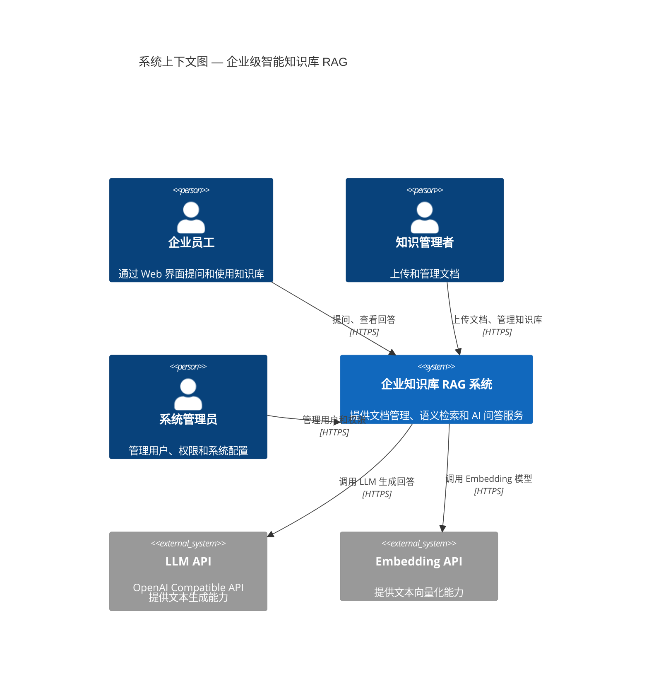
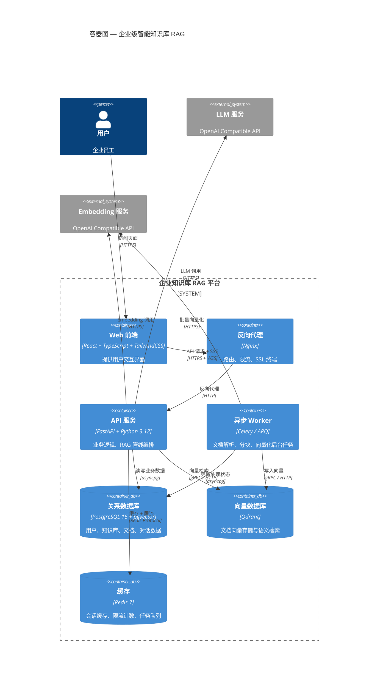
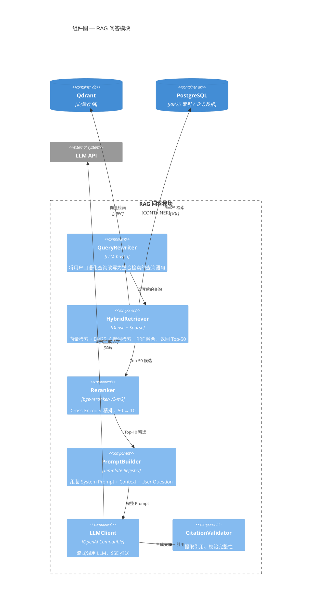
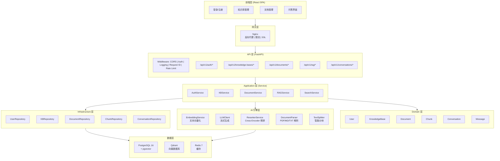
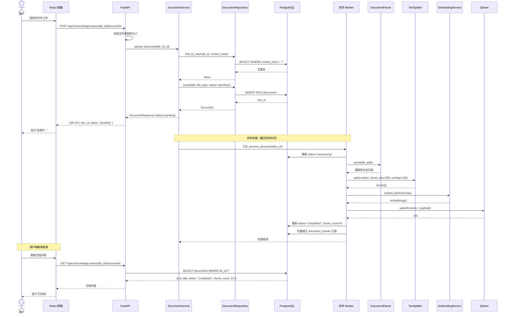
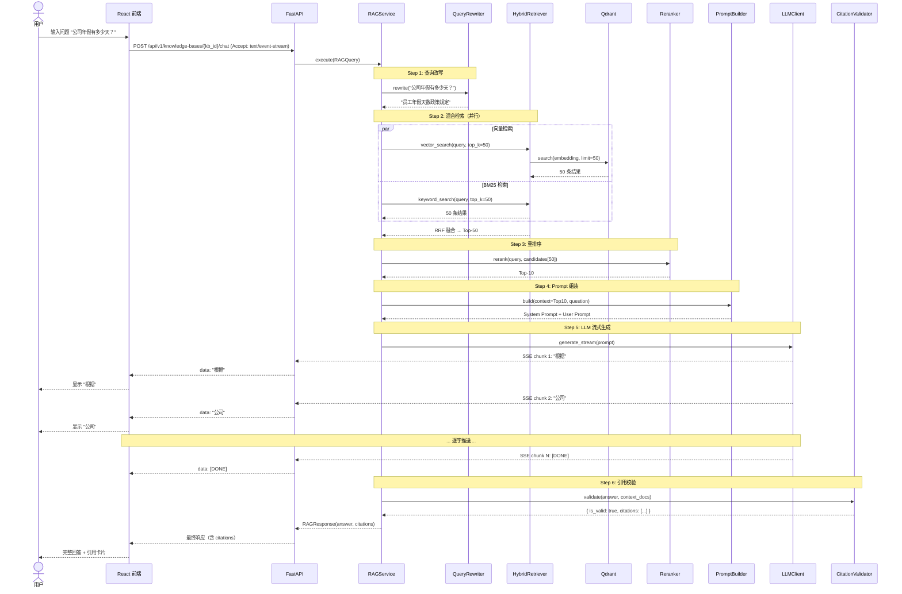
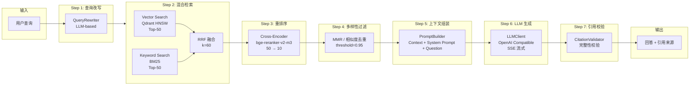
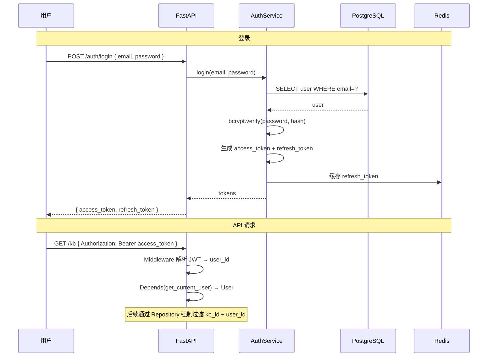
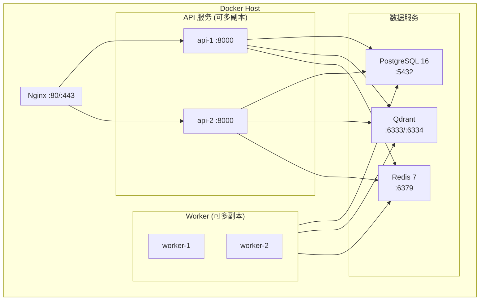

# 企业级智能知识库 RAG — 技术架构设计 (Architecture Design)

> **文档版本**: v1.0
> **创建日期**: 2026年7月10日
> **作者**: RAG 开发团队
> **状态**: Draft
> **关联文档**: [PRD.md](./PRD.md) | [ADR.md](./ADR.md) | [DATABASE.md](./DATABASE.md)

---

## 目录

1. [C4 Model 架构视图](#1-c4-model-架构视图)
2. [系统全景架构图](#2-系统全景架构图)
3. [时序图](#3-时序图)
4. [DDD 分层架构详解](#4-ddd-分层架构详解)
5. [RAG Pipeline 架构](#5-rag-pipeline-架构)
6. [配置管理](#6-配置管理)
7. [可观测性架构](#7-可观测性架构)
8. [关键技术决策](#8-关键技术决策)
9. [模块划分与职责](#9-模块划分与职责)
10. [通信协议与数据流](#10-通信协议与数据流)
11. [安全架构](#11-安全架构)
12. [部署架构](#12-部署架构)

---

## 1. C4 Model 架构视图

### 1.1 Context（系统上下文图）



### 1.2 Container（容器图）



### 1.3 Component（RAG 模块组件图）



---

## 2. 系统全景架构图



---

## 3. 时序图

### 3.1 用户上传文档



### 3.2 RAG 问答（流式）



---

## 4. DDD 分层架构详解

### 4.1 分层依赖关系

```
┌──────────────────────────────────────────────────────────────┐
│                    API 层 (app/api/)                          │
│                                                               │
│  职责：参数校验、路由转发、响应封装、认证注入                   │
│  依赖：Application 层 (Service)                               │
│  铁律：❌ 禁止任何业务逻辑                                    │
│        ❌ 禁止直接数据库操作                                  │
│        ❌ 禁止直接调用外部 API                                │
├──────────────────────────────────────────────────────────────┤
│                  Application 层 (app/services/)               │
│                                                               │
│  职责：业务流程编排、业务规则校验、事务协调、权限校验          │
│  依赖：Domain 层 + Infrastructure 层 + AI 引擎层              │
│  铁律：❌ 禁止直接 SQL/ORM 查询（必须通过 Repository）       │
│        ❌ 禁止直接操作 HTTP 请求/响应对象                     │
├──────────────────────────────────────────────────────────────┤
│                    Domain 层 (app/models/domain/)              │
│                                                               │
│  职责：领域实体、值对象、领域服务、业务规则（纯 Python）       │
│  依赖：无（不依赖任何框架和外部库）                            │
│  铁律：❌ 禁止依赖 FastAPI / SQLAlchemy / 任何框架           │
├──────────────────────────────────────────────────────────────┤
│              Infrastructure 层                                │
│  ┌─────────────────────┐  ┌─────────────────────────────┐    │
│  │ app/repositories/    │  │ app/infrastructure/          │    │
│  │                     │  │                             │    │
│  │ 数据访问层           │  │ 外部服务封装                 │    │
│  │ - UserRepo          │  │ - LLMClient                 │    │
│  │ - KBRepo            │  │ - EmbeddingClient           │    │
│  │ - DocRepo           │  │ - QdrantClient              │    │
│  │ - ChunkRepo         │  │ - RedisClient               │    │
│  │                     │  │ - FileStorage               │    │
│  └─────────────────────┘  └─────────────────────────────┘    │
│                                                               │
│  职责：数据库访问、外部服务调用、缓存操作、文件存储            │
│  铁律：❌ 禁止包含业务逻辑                                   │
│        ❌ 禁止包含业务规则判断                               │
└──────────────────────────────────────────────────────────────┘
```

### 4.2 依赖注入流向

```python
# 依赖注入链（符合 project-context.md 规范）

get_settings()           # 全局配置（单例）
    ↓
get_db()                 # 数据库会话（请求级，自动 commit/rollback）
    ↓
get_*_repository(db)     # Repository 注入
    ↓
get_*_service(repo...)   # Service 注入（依赖 Repository + AI 服务）
    ↓
Router 使用 Service       # 通过 FastAPI Depends() 注入
```

### 4.3 项目目录结构

```
backend/
├── app/
│   ├── main.py                      # FastAPI 应用入口
│   ├── api/
│   │   ├── __init__.py
│   │   ├── deps.py                  # 依赖注入（get_db, get_*_service）
│   │   └── v1/
│   │       ├── __init__.py
│   │       ├── router.py            # v1 路由汇总
│   │       ├── auth.py              # 认证接口
│   │       ├── knowledge_bases.py   # 知识库接口
│   │       ├── documents.py         # 文档接口
│   │       ├── rag.py               # RAG 问答接口
│   │       └── conversations.py     # 对话接口
│   ├── core/
│   │   ├── __init__.py
│   │   ├── config.py                # Pydantic Settings
│   │   ├── exceptions.py            # 统一异常体系
│   │   ├── exception_handlers.py    # 全局异常处理器
│   │   └── logger.py               # 统一日志
│   ├── models/
│   │   ├── __init__.py
│   │   ├── database/                # ORM 模型（SQLAlchemy）
│   │   │   ├── __init__.py
│   │   │   ├── base.py             # Base 声明
│   │   │   ├── user.py
│   │   │   ├── knowledge_base.py
│   │   │   ├── document.py
│   │   │   ├── document_chunk.py
│   │   │   ├── conversation.py
│   │   │   └── message.py
│   │   ├── domain/                  # 领域模型（纯 Pydantic）
│   │   │   ├── __init__.py
│   │   │   ├── user.py
│   │   │   ├── knowledge_base.py
│   │   │   ├── document.py
│   │   │   └── rag.py
│   │   └── request_response/        # 请求/响应 DTO
│   │       ├── __init__.py
│   │       ├── response.py          # 统一响应（APIResponse 等）
│   │       ├── auth.py
│   │       ├── knowledge_base.py
│   │       ├── document.py
│   │       └── rag.py
│   ├── services/                    # Application 层
│   │   ├── __init__.py
│   │   ├── auth_service.py
│   │   ├── kb_service.py
│   │   ├── document_service.py
│   │   ├── rag_service.py
│   │   └── search_service.py
│   ├── repositories/                # Infrastructure — 数据访问
│   │   ├── __init__.py
│   │   ├── base.py                  # 基础 Repository
│   │   ├── user_repository.py
│   │   ├── kb_repository.py
│   │   ├── document_repository.py
│   │   ├── chunk_repository.py
│   │   └── conversation_repository.py
│   ├── infrastructure/              # Infrastructure — 外部服务
│   │   ├── __init__.py
│   │   ├── llm_client.py            # LLM 统一封装
│   │   ├── embedding_client.py      # Embedding 统一封装
│   │   ├── qdrant_client.py         # Qdrant 客户端
│   │   ├── redis_client.py          # Redis 客户端
│   │   └── file_storage.py          # 文件存储
│   ├── parsers/                     # 文档解析器
│   │   ├── __init__.py
│   │   ├── base.py                  # 解析器抽象接口
│   │   ├── pdf_parser.py
│   │   ├── markdown_parser.py
│   │   ├── text_parser.py
│   │   └── registry.py             # 解析器注册中心
│   ├── rag/                         # RAG 核心管线
│   │   ├── __init__.py
│   │   ├── pipeline.py              # RAG Pipeline 编排
│   │   ├── query_rewriter.py        # 查询改写
│   │   ├── hybrid_retriever.py      # 混合检索
│   │   ├── reranker.py              # 重排序
│   │   ├── prompt_builder.py        # Prompt 构建
│   │   └── citation_validator.py    # 引用校验
│   ├── prompts/                     # Prompt 模板
│   │   ├── __init__.py
│   │   ├── registry.py              # 模板注册中心
│   │   ├── rag_prompts.py           # RAG 相关模板
│   │   └── system_prompts.py        # System Prompt 模板
│   ├── middleware/                   # 中间件
│   │   ├── __init__.py
│   │   ├── request_id.py            # Request ID 注入
│   │   ├── logging.py               # 请求日志
│   │   └── rate_limit.py            # 限流
│   └── utils/                       # 工具函数
│       ├── __init__.py
│       ├── text_splitter.py         # 文档分块器
│       ├── token_counter.py         # Token 计数
│       └── security.py              # 密码哈希、JWT
├── migrations/                      # Alembic 迁移
│   ├── env.py
│   ├── versions/
│   └── alembic.ini
├── tests/
│   ├── conftest.py
│   ├── unit/
│   ├── integration/
│   └── e2e/
├── pyproject.toml
├── Dockerfile
├── docker-compose.yml
└── .env.template
```

---

## 5. RAG Pipeline 架构

### 5.1 完整管线流程



### 5.2 硬性参数标准

| 阶段 | 参数 | 硬性值 | 说明 |
|------|------|--------|------|
| 文档分块 | chunk_size | 500 tokens（范围 500~800） | RecursiveCharacterTextSplitter |
| 文档分块 | chunk_overlap | 100 tokens | 固定 |
| 混合检索 | 向量召回数 | 50 | 两路各 50 |
| 混合检索 | 融合算法 | RRF (k=60) | Reciprocal Rank Fusion |
| 混合检索 | 候选输出数 | 50 | 融合后取 Top-50 |
| 重排序 | 输入 | 50 条候选 | 来自混合检索 |
| 重排序 | 输出 | 10 条 | Cross-Encoder 精排 |
| 多样性过滤 | 相似度阈值 | 0.95 | 余弦相似度 |
| 上下文组装 | 最大文档数 | 10 | 传给 LLM 的文档数 |
| 引用校验 | 引用编号 | 必须存在 | 每个 [N] 必须能对应到文档 |

---

## 6. 配置管理

### 6.1 配置层次结构

```
┌─────────────────────────────────────┐
│            .env 文件                 │
│  DATABASE_URL=...                   │
│  LLM_API_KEY=...                    │
│  QDRANT_URL=...                     │
└──────────────┬──────────────────────┘
               │ 读取
┌──────────────▼──────────────────────┐
│      Pydantic Settings              │
│      app/core/config.py             │
│                                      │
│  ┌─────────────────────────────┐    │
│  │ AppConfig                   │    │
│  │ - APP_NAME                  │    │
│  │ - DEBUG                     │    │
│  │ - LOG_LEVEL                 │    │
│  └─────────────────────────────┘    │
│  ┌─────────────────────────────┐    │
│  │ DBConfig                    │    │
│  │ - DATABASE_URL              │    │
│  │ - DB_POOL_SIZE              │    │
│  │ - DB_ECHO                   │    │
│  └─────────────────────────────┘    │
│  ┌─────────────────────────────┐    │
│  │ RedisConfig                 │    │
│  │ - REDIS_URL                 │    │
│  └─────────────────────────────┘    │
│  ┌─────────────────────────────┐    │
│  │ LLMConfig                   │    │
│  │ - LLM_API_KEY               │    │
│  │ - LLM_BASE_URL              │    │
│  │ - LLM_MODEL                 │    │
│  │ - LLM_TEMPERATURE           │    │
│  │ - LLM_MAX_TOKENS            │    │
│  └─────────────────────────────┘    │
│  ┌─────────────────────────────┐    │
│  │ EmbedConfig                 │    │
│  │ - EMBEDDING_MODEL           │    │
│  │ - EMBEDDING_DIMENSION       │    │
│  │ - EMBEDDING_BATCH_SIZE      │    │
│  └─────────────────────────────┘    │
│  ┌─────────────────────────────┐    │
│  │ QdrantConfig                │    │
│  │ - QDRANT_URL                │    │
│  │ - QDRANT_COLLECTION         │    │
│  │ - QDRANT_VECTOR_SIZE        │    │
│  └─────────────────────────────┘    │
│  ┌─────────────────────────────┐    │
│  │ SecurityConfig              │    │
│  │ - JWT_SECRET_KEY            │    │
│  │ - JWT_ACCESS_TOKEN_EXPIRE   │    │
│  │ - JWT_REFRESH_TOKEN_EXPIRE  │    │
│  │ - BCRYPT_ROUNDS             │    │
│  └─────────────────────────────┘    │
└──────────────┬──────────────────────┘
               │ Depends()
┌──────────────▼──────────────────────┐
│     Dependency Injection            │
│     app/api/deps.py                  │
│                                      │
│  get_settings() → Settings (单例)    │
│  get_db() → AsyncSession (请求级)   │
│  get_*_service() → 注入到 Router   │
└─────────────────────────────────────┘
```

### 6.2 配置实现

```python
# app/core/config.py
from pydantic_settings import BaseSettings
from functools import lru_cache

class Settings(BaseSettings):
    # 应用
    APP_NAME: str = "企业知识库RAG"
    APP_VERSION: str = "1.0.0"
    DEBUG: bool = False
    LOG_LEVEL: str = "INFO"

    # 数据库
    DATABASE_URL: str
    DB_POOL_SIZE: int = 20
    DB_MAX_OVERFLOW: int = 10
    DB_ECHO: bool = False

    # Redis
    REDIS_URL: str = "redis://localhost:6379/0"

    # LLM
    LLM_API_KEY: str
    LLM_BASE_URL: str = "https://api.openai.com/v1"
    LLM_MODEL: str = "gpt-4o"
    LLM_TEMPERATURE: float = 0.3
    LLM_MAX_TOKENS: int = 2048

    # Embedding
    EMBEDDING_API_KEY: str | None = None  # 默认复用 LLM_API_KEY
    EMBEDDING_BASE_URL: str | None = None
    EMBEDDING_MODEL: str = "text-embedding-3-large"
    EMBEDDING_DIMENSION: int = 3072
    EMBEDDING_BATCH_SIZE: int = 32

    # Qdrant
    QDRANT_URL: str = "http://localhost:6333"
    QDRANT_COLLECTION: str = "kb_chunks"
    QDRANT_VECTOR_SIZE: int = 3072

    # 安全
    JWT_SECRET_KEY: str
    JWT_ACCESS_TOKEN_EXPIRE_MINUTES: int = 1440  # 24h
    JWT_REFRESH_TOKEN_EXPIRE_DAYS: int = 7
    BCRYPT_ROUNDS: int = 12

    # 文件
    UPLOAD_DIR: str = "./uploads"
    MAX_FILE_SIZE_MB: int = 100

    # 分块参数（可配置但有默认值）
    CHUNK_SIZE: int = 500
    CHUNK_OVERLAP: int = 100
    RETRIEVAL_TOP_K: int = 50
    RERANK_TOP_K: int = 10

    model_config = {"env_file": ".env", "env_file_encoding": "utf-8"}

@lru_cache()
def get_settings() -> Settings:
    return Settings()
```

---

## 7. 可观测性架构

### 7.1 三大支柱

```
┌─────────────────────────────────────────────────────────┐
│                    可观测性体系                           │
│                                                          │
│  ┌──────────────┐  ┌──────────────┐  ┌──────────────┐  │
│  │   Logging    │  │   Tracing    │  │   Metrics    │  │
│  │   日志        │  │   链路追踪    │  │   指标监控    │  │
│  ├──────────────┤  ├──────────────┤  ├──────────────┤  │
│  │ 结构化 JSON  │  │ Request ID   │  │ 请求计数     │  │
│  │ 统一 get_    │  │ 全链路传递   │  │ 延迟分布     │  │
│  │ logger()     │  │ Middleware   │  │ 错误率       │  │
│  │ 级别控制     │  │ → Service    │  │ LLM Token    │  │
│  │              │  │ → Repository │  │ Qdrant QPS   │  │
│  │              │  │ → LLM Call   │  │              │  │
│  └──────┬───────┘  └──────┬───────┘  └──────┬───────┘  │
│         │                 │                 │           │
│         ▼                 ▼                 ▼           │
│  ┌──────────────────────────────────────────────────┐  │
│  │              未来演进                               │  │
│  │  OpenTelemetry → Prometheus → Grafana            │  │
│  │  ELK / Loki 日志聚合                               │  │
│  │  Jaeger / Tempo 分布式追踪                          │  │
│  └──────────────────────────────────────────────────┘  │
└─────────────────────────────────────────────────────────┘
```

### 7.2 Request ID 全链路追踪

```python
# Middleware 层自动注入
# app/middleware/request_id.py

import uuid
from fastapi import Request
from starlette.middleware.base import BaseHTTPMiddleware

class RequestIDMiddleware(BaseHTTPMiddleware):
    async def dispatch(self, request: Request, call_next):
        request_id = request.headers.get("X-Request-ID", str(uuid.uuid4()))
        # 注入到上下文变量，后续 Service/Repository/LLM Call 均可用
        request.state.request_id = request_id
        response = await call_next(request)
        response.headers["X-Request-ID"] = request_id
        return response
```

### 7.3 健康检查

```python
# GET /health
@router.get("/health")
async def health_check():
    checks = {
        "database": await check_db(),
        "redis": await check_redis(),
        "qdrant": await check_qdrant(),
    }
    all_healthy = all(checks.values())
    status_code = 200 if all_healthy else 503
    return JSONResponse(
        content={
            "status": "healthy" if all_healthy else "unhealthy",
            "version": settings.APP_VERSION,
            "checks": checks,
        },
        status_code=status_code,
    )
```

---

## 8. 关键技术决策

> 详细决策记录见 [ADR.md](./ADR.md)，此处列出关键决策概要。

| # | 决策点 | 选择 | 核心理由 |
|---|--------|------|---------|
| 1 | 向量数据库 | **Qdrant** | 单二进制部署极简、Rust 高性能、内置 Payload 索引 |
| 2 | 关系数据库 | **PostgreSQL 16** | pgvector 扩展、JSONB 支持、ACID 严格 |
| 3 | 后端框架 | **FastAPI** | 原生异步、自动 OpenAPI、Pydantic 集成 |
| 4 | ORM | **SQLAlchemy 2.x** | 异步原生支持、成熟生态、类型安全 |
| 5 | 架构模式 | **DDD 分层** | 高内聚低耦合、每层可独立测试和替换 |
| 6 | 检索策略 | **Hybrid + RRF** | 语义 + 关键词互补，RRF 无需调参 |
| 7 | 重排序 | **bge-reranker-v2-m3** | 本地运行零成本、中文效果好、M3 多语言 |
| 8 | 配置管理 | **Pydantic Settings** | 类型安全、环境变量/.env 双支持、FastAPI 原生集成 |
| 9 | 代码质量 | **Black + Ruff + MyPy** | 业界标准、CI 友好、零配置分歧 |
| 10 | 部署方案 | **Docker Compose** | MVP 阶段最简单、资源需求低、一键启动 |

---

## 9. 模块划分与职责

| 模块 | 目录 | 核心职责 | 对外接口 |
|------|------|---------|---------|
| **认证模块** | `app/services/auth_service.py` | 用户注册/登录/JWT Token 管理/权限校验 | `AuthService.register()` / `login()` / `refresh_token()` |
| **知识库模块** | `app/services/kb_service.py` | 知识库 CRUD、成员管理、统计 | `KBService.create()` / `list()` / `add_member()` |
| **文档模块** | `app/services/document_service.py` | 文档上传编排、状态管理、删除 | `DocumentService.upload()` / `get_status()` / `delete()` |
| **解析模块** | `app/parsers/` | 多格式文档解析（PDF/MD/TXT/DOCX） | `BaseParser.parse()` → `str` |
| **分块模块** | `app/utils/text_splitter.py` | 智能文本分块 | `TextSplitter.split(text)` → `list[str]` |
| **Embedding 模块** | `app/infrastructure/embedding_client.py` | 文本向量化封装（支持多模型） | `EmbeddingClient.embed()` / `embed_batch()` |
| **向量存储模块** | `app/infrastructure/qdrant_client.py` | Qdrant 向量读写、检索 | `QdrantClient.search()` / `upsert()` / `delete()` |
| **检索模块** | `app/rag/hybrid_retriever.py` | 混合检索（向量+BM25+RRF） | `HybridRetriever.retrieve(query)` → `list[Document]` |
| **重排序模块** | `app/rag/reranker.py` | Cross-Encoder 精排 | `Reranker.rerank(query, docs)` → `list[Document]` |
| **Prompt 模块** | `app/prompts/` | Prompt 模板注册与渲染 | `PromptRegistry.render(name, **vars)` → `str` |
| **LLM 模块** | `app/infrastructure/llm_client.py` | LLM 调用封装（流式+非流式） | `LLMClient.generate()` / `generate_stream()` |
| **引用模块** | `app/rag/citation_validator.py` | 引用提取与完整性校验 | `CitationValidator.validate(answer, docs)` |
| **RAG 编排** | `app/rag/pipeline.py` | 完整 RAG Pipeline 编排 | `RAGPipeline.execute(query)` → `RAGResponse` |

---

## 10. 通信协议与数据流

### 10.1 协议矩阵

| 通信路径 | 协议 | 说明 |
|---------|------|------|
| 前端 ↔ Nginx | HTTPS | 生产环境强制 TLS |
| Nginx ↔ FastAPI | HTTP/1.1 | 内网通信 |
| FastAPI → PostgreSQL | asyncpg (PostgreSQL Wire Protocol) | 异步连接池 |
| FastAPI → Qdrant | gRPC（推荐）或 HTTP REST | 向量检索与写入 |
| FastAPI → Redis | Redis RESP | 缓存 + 限流 |
| FastAPI → LLM API | HTTPS | OpenAI Compatible API |
| FastAPI → Embedding API | HTTPS | OpenAI Compatible API |
| 前端 ↔ FastAPI (SSE) | HTTPS + SSE | 流式回答推送 |

### 10.2 流式回答数据流（SSE）

```
POST /api/v1/rag/ask
Accept: text/event-stream

← Server-Sent Events →
event: token
data: {"content": "根据"}

event: token
data: {"content": "公司"}

event: token
data: {"content": "考勤"}

...

event: citation
data: {"citations": [{"index": 1, "title": "员工手册", ...}]}

event: done
data: {"conversation_id": "conv-xxx", "token_usage": {...}}
```

---

## 11. 安全架构

### 11.1 纵深防御

```
┌──────────────────────────────────────────────┐
│              安全防护层次                       │
│                                               │
│  第 1 层：网络层                               │
│  ├── Nginx 反向代理                            │
│  ├── HTTPS 强制（TLS 1.3）                    │
│  ├── Rate Limiting（30 req/min/IP）           │
│  └── Request Size Limit（100MB）              │
│                                               │
│  第 2 层：认证层                               │
│  ├── JWT Access Token（24h）+ Refresh（7d）   │
│  ├── Password bcrypt（cost=12）               │
│  └── Token 黑名单（Redis）                    │
│                                               │
│  第 3 层：授权层                               │
│  ├── RBAC 角色权限（Viewer/Admin/SuperAdmin）  │
│  ├── 知识库级别权限隔离                         │
│  └── Repository 层强制过滤（user_id/kb_id）    │
│                                               │
│  第 4 层：应用层                               │
│  ├── 参数化查询（SQLAlchemy）                  │
│  ├── 输入校验（Pydantic）                      │
│  ├── 输出编码（XSS 防护）                      │
│  └── CSP / CORS Headers                       │
│                                               │
│  第 5 层：数据层                               │
│  ├── API Key AES-256 加密存储                  │
│  ├── 日志脱敏（密码/Token/API Key）            │
│  └── 数据库密码通过 .env（不纳入 Git）          │
└──────────────────────────────────────────────┘
```

### 11.2 认证流程



---

## 12. 部署架构

### 12.1 Docker Compose 拓扑



### 12.2 服务清单

| 服务 | 镜像 | 端口 | 副本 | 资源限制 |
|------|------|------|------|---------|
| nginx | nginx:alpine | 80, 443 | 1 | 256MB |
| api | 自构建 | 8000 | 2 | 1GB / 2CPU |
| worker | 自构建 | — | 2 | 2GB / 2CPU |
| postgres | postgres:16 | 5432 | 1 | 2GB / 2CPU |
| qdrant | qdrant/qdrant | 6333, 6334 | 1 | 2GB / 2CPU |
| redis | redis:7-alpine | 6379 | 1 | 512MB |

---

> **下一步**: 阅读 [架构决策记录 (ADR.md)](./ADR.md) 了解每个技术决策的详细理由和权衡。
