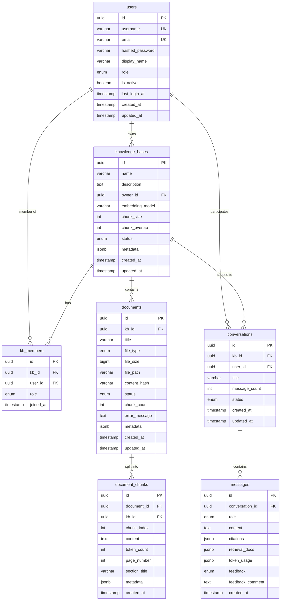
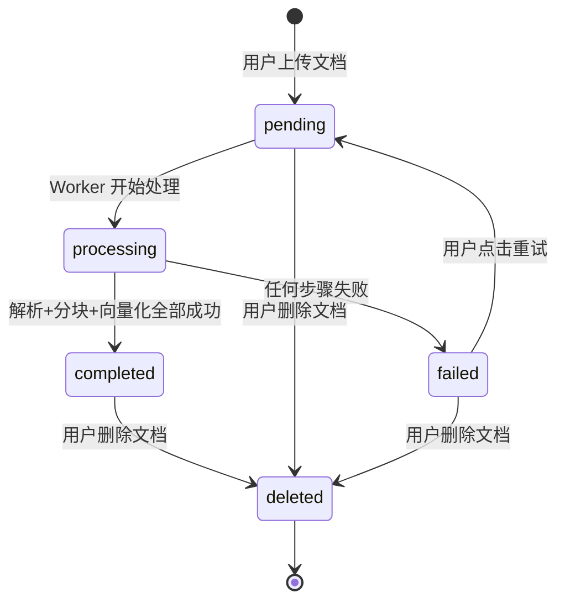

# 企业级智能知识库 RAG — 数据库设计

> **文档版本**: v1.0
> **创建日期**: 2026年7月10日
> **关联文档**: [ARCHITECTURE.md](./ARCHITECTURE.md) | [PRD.md](./PRD.md) | [ADR.md](./ADR.md)

---

## 目录

1. [设计理念与原则](#1-设计理念与原则)
2. [实体关系图（ER图）](#2-实体关系图er图)
3. [数据生命周期（状态机）](#3-数据生命周期状态机)
4. [完整表结构设计](#4-完整表结构设计)
5. [删除策略](#5-删除策略)
6. [索引设计](#6-索引设计)
7. [向量存储设计（Qdrant）](#7-向量存储设计qdrant)
8. [数据迁移策略（Alembic）](#8-数据迁移策略alembic)
9. [备份与恢复策略](#9-备份与恢复策略)

---

## 1. 设计理念与原则

### 1.1 为什么这样设计？

在开始看具体表结构之前，先理解 **7 张表的职责分离逻辑**：

```
问题：为什么要把 KnowledgeBase、Document、Chunk 分成三张表，
      而不是一张大表？

回答：因为它们的生命周期、职责和操作频率完全不同。
```

#### KnowledgeBase — 独立的业务实体

| 维度 | 说明 |
|------|------|
| **职责** | 承载知识库级别的配置（chunk_size、embedding_model、权限策略） |
| **关系** | 与 Document 是 1:N 关系（一个知识库可以有多个文档） |
| **独立理由** | 修改知识库配置不影响已有文档；删除知识库时才级联删除文档 |
| **操作频率** | 低（创建/配置时操作，日常不频繁变更） |

#### Document — 物理文件的抽象

| 维度 | 说明 |
|------|------|
| **职责** | 表示一份上传的物理文件，承载处理状态（pending→processing→completed） |
| **关系** | 与 Chunk 是 1:N 关系（一个文档被切成多个块） |
| **独立理由** | 删除一份文档可级联删除其所有 Chunk + Qdrant 向量；支持重处理 |
| **操作频率** | 中等（上传、删除、状态查询） |

#### Chunk — 检索的最小单元

| 维度 | 说明 |
|------|------|
| **职责** | 一段语义完整的文本片段，是向量检索和引用定位的最小单位 |
| **关系** | 属于一个 Document |
| **独立理由** | 检索时直接操作 Chunk（不经过 Document 层），独立的索引策略 |
| **操作频率** | 低（写入后很少单独修改，检索时不操作 PG 而是操作 Qdrant） |

### 1.2 核心设计原则

| 原则 | 说明 |
|------|------|
| **UUID 主键** | 所有表主键使用 UUID，分布式友好、安全（不可遍历）、离线生成 |
| **JSONB 而非 EAV** | metadata 使用 JSONB，灵活且可索引，PostgreSQL 原生优化 |
| **统一时间戳** | 使用 `TIMESTAMP WITH TIME ZONE`，UTC 存储，前端转换 |
| **外键约束** | 所有关联使用外键，保证引用完整性（开发环境；生产环境可选择性启用） |
| **命名规范** | 表名复数、字段名 snake_case、索引名 `idx_表名_字段名` |
| **软删除优先** | 核心实体使用 status 字段标记删除（而非物理删除），支持恢复和审计 |

---

## 2. 实体关系图（ER图）



---

## 3. 数据生命周期（状态机）

### 3.1 Document 状态机



| 状态 | 含义 | 下一步 |
|------|------|--------|
| **pending** | 已上传，等待处理 | Worker 取走 → processing |
| **processing** | Worker 正在处理中 | 完成 → completed / 失败 → failed |
| **completed** | 处理完成，可被检索 | 可正常检索和问答 |
| **failed** | 处理失败 | 查看 error_message，可重试 → pending |
| **deleted** | 已删除（软删除） | 数据保留，不可检索 |

### 3.2 Chunk 生命周期

```
文档上传 → pending
    ↓
Worker 解析文档 → 生成 Chunks
    ↓
每个 Chunk → Embedding → 写入 Qdrant
    ↓
Chunk 与 Qdrant Point 通过 chunk_id 关联
    ↓
文档删除时：
  1. PG: Chunk 跟随 Document 软删除（status=deleted）
  2. Qdrant: 根据 chunk_id 删除对应的向量
```

### 3.3 Conversation 生命周期

```
用户首次提问 → 创建 Conversation (status=active)
    ↓
每轮对话追加 Message
    ↓
用户可归档 → status=archived
    ↓
归档后仍可查看历史，但不再追加消息
```

---

## 4. 完整表结构设计

### 4.1 users（用户表）

```sql
CREATE EXTENSION IF NOT EXISTS "uuid-ossp";

CREATE TYPE user_role AS ENUM ('super_admin', 'admin', 'user');

CREATE TABLE users (
    -- 主键
    id              UUID PRIMARY KEY DEFAULT uuid_generate_v4(),

    -- 登录信息
    username        VARCHAR(50)  NOT NULL,
    email           VARCHAR(255) NOT NULL,
    hashed_password VARCHAR(255) NOT NULL,

    -- 个人信息
    display_name    VARCHAR(100),
    avatar_url      VARCHAR(500),

    -- 角色与状态
    role            user_role NOT NULL DEFAULT 'user',
    is_active       BOOLEAN NOT NULL DEFAULT TRUE,

    -- 时间戳
    last_login_at   TIMESTAMPTZ,
    created_at      TIMESTAMPTZ NOT NULL DEFAULT NOW(),
    updated_at      TIMESTAMPTZ NOT NULL DEFAULT NOW(),

    -- 约束
    CONSTRAINT uq_users_username UNIQUE (username),
    CONSTRAINT uq_users_email    UNIQUE (email),
    CONSTRAINT ck_users_username_length CHECK (char_length(username) BETWEEN 3 AND 50),
    CONSTRAINT ck_users_password_length CHECK (char_length(hashed_password) >= 60)
);

-- 注释
COMMENT ON TABLE users IS '用户表';
COMMENT ON COLUMN users.id IS '用户唯一标识（UUID）';
COMMENT ON COLUMN users.username IS '用户名，登录用，3-50字符';
COMMENT ON COLUMN users.email IS '邮箱，唯一，用于登录和通知';
COMMENT ON COLUMN users.hashed_password IS 'bcrypt 哈希后的密码';
COMMENT ON COLUMN users.role IS '角色: super_admin=超级管理员, admin=管理员, user=普通用户';
COMMENT ON COLUMN users.is_active IS '账号是否启用（禁用后无法登录）';
```

### 4.2 knowledge_bases（知识库表）

```sql
CREATE TYPE kb_status AS ENUM ('active', 'archived', 'deleted');

CREATE TABLE knowledge_bases (
    -- 主键
    id              UUID PRIMARY KEY DEFAULT uuid_generate_v4(),

    -- 基本信息
    name            VARCHAR(255) NOT NULL,
    description     TEXT DEFAULT '',

    -- 所有者
    owner_id        UUID NOT NULL REFERENCES users(id) ON DELETE RESTRICT,

    -- 处理配置
    embedding_model VARCHAR(100) NOT NULL DEFAULT 'text-embedding-3-large',
    chunk_size      INTEGER NOT NULL DEFAULT 500,
    chunk_overlap   INTEGER NOT NULL DEFAULT 100,

    -- 状态
    status          kb_status NOT NULL DEFAULT 'active',

    -- 扩展元数据
    metadata        JSONB DEFAULT '{}',

    -- 时间戳
    created_at      TIMESTAMPTZ NOT NULL DEFAULT NOW(),
    updated_at      TIMESTAMPTZ NOT NULL DEFAULT NOW(),

    -- 约束
    CONSTRAINT uq_kb_name_owner UNIQUE (name, owner_id),
    CONSTRAINT ck_kb_name_length CHECK (char_length(name) BETWEEN 1 AND 255),
    CONSTRAINT ck_chunk_size CHECK (chunk_size BETWEEN 500 AND 800),
    CONSTRAINT ck_chunk_overlap CHECK (chunk_overlap BETWEEN 50 AND 200)
);

COMMENT ON TABLE knowledge_bases IS '知识库表';
COMMENT ON COLUMN knowledge_bases.embedding_model IS '使用的 Embedding 模型名称';
COMMENT ON COLUMN knowledge_bases.chunk_size IS '文档分块大小（Token 数），范围 500-800';
COMMENT ON COLUMN knowledge_bases.chunk_overlap IS '分块重叠大小（Token 数），范围 50-200';
COMMENT ON COLUMN knowledge_bases.metadata IS '扩展元数据，JSON 格式，如 {"department":"HR", "tags":["制度","考勤"]}';
```

### 4.3 kb_members（知识库成员表）

```sql
CREATE TYPE member_role AS ENUM ('admin', 'editor', 'viewer');

CREATE TABLE kb_members (
    -- 主键
    id          UUID PRIMARY KEY DEFAULT uuid_generate_v4(),

    -- 关联
    kb_id       UUID NOT NULL REFERENCES knowledge_bases(id) ON DELETE CASCADE,
    user_id     UUID NOT NULL REFERENCES users(id) ON DELETE CASCADE,

    -- 权限
    role        member_role NOT NULL DEFAULT 'viewer',

    -- 时间戳
    joined_at   TIMESTAMPTZ NOT NULL DEFAULT NOW(),

    -- 约束
    CONSTRAINT uq_kb_user UNIQUE (kb_id, user_id)
);

COMMENT ON TABLE kb_members IS '知识库成员表（多对多关联）';
COMMENT ON COLUMN kb_members.role IS '成员角色: admin=管理员(管理+上传+删除), editor=编辑者(上传+删除), viewer=查看者(仅问答)';
```

### 4.4 documents（文档表）

```sql
CREATE TYPE doc_type AS ENUM ('pdf', 'docx', 'md', 'txt', 'html', 'image');
CREATE TYPE doc_status AS ENUM ('pending', 'processing', 'completed', 'failed', 'deleted');

CREATE TABLE documents (
    -- 主键
    id              UUID PRIMARY KEY DEFAULT uuid_generate_v4(),

    -- 所属知识库
    kb_id           UUID NOT NULL REFERENCES knowledge_bases(id) ON DELETE CASCADE,

    -- 基本信息
    title           VARCHAR(500) NOT NULL,
    file_type       doc_type NOT NULL,
    file_size       BIGINT,                                 -- 文件大小（字节）
    file_path       VARCHAR(1000),                          -- 原始文件存储路径

    -- 去重
    content_hash    VARCHAR(64),                            -- SHA-256 内容哈希

    -- 处理状态
    status          doc_status NOT NULL DEFAULT 'pending',
    chunk_count     INTEGER DEFAULT 0,
    error_message   TEXT,                                   -- 处理失败时的错误详情

    -- 扩展元数据
    metadata        JSONB DEFAULT '{}',                     -- { "author": "HR", "pages": 25, "created_date": "2024-01-15" }

    -- 时间戳
    created_at      TIMESTAMPTZ NOT NULL DEFAULT NOW(),
    updated_at      TIMESTAMPTZ NOT NULL DEFAULT NOW(),

    -- 约束
    CONSTRAINT uq_doc_hash_kb UNIQUE (kb_id, content_hash),
    CONSTRAINT ck_doc_title_length CHECK (char_length(title) BETWEEN 1 AND 500)
);

COMMENT ON TABLE documents IS '文档表（物理文件的抽象）';
COMMENT ON COLUMN documents.content_hash IS 'SHA-256 内容哈希，用于去重检测';
COMMENT ON COLUMN documents.status IS '处理状态: pending=待处理, processing=处理中, completed=已完成, failed=失败, deleted=已删除';
COMMENT ON COLUMN documents.chunk_count IS '分块总数（处理完成后填充）';
COMMENT ON COLUMN documents.error_message IS '处理失败时记录的具体错误信息';
```

### 4.5 document_chunks（文档分块表）

```sql
CREATE TABLE document_chunks (
    -- 主键
    id              UUID PRIMARY KEY DEFAULT uuid_generate_v4(),

    -- 关联
    document_id     UUID NOT NULL REFERENCES documents(id) ON DELETE CASCADE,
    kb_id           UUID NOT NULL REFERENCES knowledge_bases(id) ON DELETE CASCADE,

    -- 分块信息
    chunk_index     INTEGER NOT NULL,                       -- 在文档中的序号（从0开始）
    content         TEXT NOT NULL,                           -- 分块文本内容
    token_count     INTEGER,                                -- Token 数量

    -- 位置信息（PDF 等有页码的文档）
    page_number     INTEGER,                                -- 所在页码
    section_title   VARCHAR(500),                           -- 所属章节标题

    -- 扩展元数据
    metadata        JSONB DEFAULT '{}',

    -- 时间戳
    created_at      TIMESTAMPTZ NOT NULL DEFAULT NOW(),

    -- 约束
    CONSTRAINT uq_chunk_doc_index UNIQUE (document_id, chunk_index)
);

COMMENT ON TABLE document_chunks IS '文档分块表（检索的最小单元）';
COMMENT ON COLUMN document_chunks.content IS '分块后的文本片段，500-800 tokens';
COMMENT ON COLUMN document_chunks.chunk_index IS '分块在文档中的序号，用于排序和定位';
COMMENT ON COLUMN document_chunks.page_number IS '源文档页码，用于引用展示（PDF/Word 文档）';
COMMENT ON COLUMN document_chunks.section_title IS '所属章节标题，如"第三章 考勤制度"';
```

### 4.6 conversations（对话会话表）

```sql
CREATE TYPE conv_status AS ENUM ('active', 'archived');

CREATE TABLE conversations (
    -- 主键
    id              UUID PRIMARY KEY DEFAULT uuid_generate_v4(),

    -- 关联
    kb_id           UUID NOT NULL REFERENCES knowledge_bases(id),
    user_id         UUID NOT NULL REFERENCES users(id),

    -- 基本信息
    title           VARCHAR(500),                            -- 自动生成的对话标题
    message_count   INTEGER DEFAULT 0,                       -- 消息总数

    -- 状态
    status          conv_status NOT NULL DEFAULT 'active',

    -- 时间戳
    created_at      TIMESTAMPTZ NOT NULL DEFAULT NOW(),
    updated_at      TIMESTAMPTZ NOT NULL DEFAULT NOW()
);

COMMENT ON TABLE conversations IS '对话会话表';
COMMENT ON COLUMN conversations.title IS '对话标题，由第一条问题的前50字符自动生成';
```

### 4.7 messages（消息表）

```sql
CREATE TYPE msg_role AS ENUM ('user', 'assistant', 'system');
CREATE TYPE msg_feedback AS ENUM ('positive', 'negative');

CREATE TABLE messages (
    -- 主键
    id                UUID PRIMARY KEY DEFAULT uuid_generate_v4(),

    -- 所属对话
    conversation_id   UUID NOT NULL REFERENCES conversations(id) ON DELETE CASCADE,

    -- 消息内容
    role              msg_role NOT NULL,                     -- user / assistant / system
    content           TEXT NOT NULL,

    -- RAG 相关
    citations         JSONB DEFAULT '[]',                    -- 引用来源列表
    retrieval_docs    JSONB DEFAULT '[]',                    -- 检索到的文档片段（调试用）

    -- Token 消耗
    token_usage       JSONB DEFAULT '{}',                    -- {"prompt_tokens": 1250, "completion_tokens": 180, "total_tokens": 1430}

    -- 用户反馈
    feedback          msg_feedback,                          -- 点赞/点踩
    feedback_comment  TEXT,                                  -- 反馈评语

    -- 时间戳
    created_at        TIMESTAMPTZ NOT NULL DEFAULT NOW()
);

COMMENT ON TABLE messages IS '消息表（对话中的每条消息）';
COMMENT ON COLUMN messages.citations IS '引用来源 JSON: [{"index":1, "document_title":"...", "page_number":12, "content_snippet":"...", "relevance_score":0.92}]';
COMMENT ON COLUMN messages.token_usage IS 'Token 消耗统计，用于成本核算';
```

---

## 5. 删除策略

### 5.1 三种删除方式

| 方式 | 操作 | 数据变化 | 可恢复 |
|------|------|---------|:---:|
| **Soft Delete**（推荐） | 设置 `status = 'deleted'` | PG 数据保留，Qdrant 向量同步标记为不可检索 | ✅ |
| **Hard Delete** | 物理删除 PG 记录 | PG 数据永久删除，Qdrant 向量同步删除 | ❌ |
| **级联删除** | 删除 KnowledgeBase | 级联删除 → Document → Chunk → Qdrant 向量 | ❌ |

### 5.2 向量同步删除（关键设计）

这是很多人会忽略的关键点：**删除 PG 中的 Chunk 时必须同步删除 Qdrant 中的向量**，否则会产生"幽灵向量"——检索时返回了向量结果，但对应的 Chunk 记录已经不存在。

```python
# 伪代码：删除文档时的完整流程
async def delete_document(doc_id: str):
    # 1. 获取该文档的所有 Chunk ID
    chunk_ids = await chunk_repo.get_chunk_ids_by_document(doc_id)

    # 2. 同步删除 Qdrant 中的向量
    await qdrant_client.delete_points(
        collection_name="kb_chunks",
        filter={"chunk_id": {"$in": chunk_ids}}
    )

    # 3. 软删除 PG 中的记录
    await doc_repo.soft_delete(doc_id)
    await chunk_repo.soft_delete_by_document(doc_id)
```

### 5.3 删除策略总结

| 实体 | 删除方式 | Qdrant 同步 | 说明 |
|------|---------|------------|------|
| KnowledgeBase | 级联删除 | ✅ 删除所有关联向量 | 需二次确认 |
| Document | 软删除 | ✅ 删除所有 Chunk 向量 | 可恢复 |
| Chunk | 不支持单独删除 | - | Chunk 随 Document 一起管理 |
| Conversation | 软删除 | N/A | 对话不涉及向量 |
| Message | 不支持单独删除 | N/A | 消息随 Conversation 一起管理 |

---

## 6. 索引设计

### 6.1 users 表索引

```sql
CREATE UNIQUE INDEX idx_users_email ON users(email);
CREATE UNIQUE INDEX idx_users_username ON users(username);
CREATE INDEX idx_users_role ON users(role) WHERE is_active = TRUE;
```

### 6.2 knowledge_bases 表索引

```sql
CREATE INDEX idx_kb_owner ON knowledge_bases(owner_id);
CREATE INDEX idx_kb_status ON knowledge_bases(status) WHERE status != 'deleted';
CREATE INDEX idx_kb_name_trgm ON knowledge_bases USING gin (name gin_trgm_ops);
-- gin_trgm_ops 支持模糊搜索（需要 CREATE EXTENSION IF NOT EXISTS pg_trgm）
```

### 6.3 kb_members 表索引

```sql
CREATE INDEX idx_kbm_user ON kb_members(user_id);
CREATE INDEX idx_kbm_kb ON kb_members(kb_id);
-- 主键 + uq_kb_user 约束已覆盖联合查询
```

### 6.4 documents 表索引

```sql
CREATE INDEX idx_doc_kb ON documents(kb_id);
CREATE INDEX idx_doc_status ON documents(status);
CREATE INDEX idx_doc_type ON documents(file_type);
CREATE INDEX idx_doc_created ON documents(created_at DESC);
-- uq_doc_hash_kb 约束已覆盖去重查询
```

### 6.5 document_chunks 表索引

```sql
CREATE INDEX idx_chunk_doc ON document_chunks(document_id);
CREATE INDEX idx_chunk_kb ON document_chunks(kb_id);
-- uq_chunk_doc_index 约束已覆盖 (document_id, chunk_index) 查询
```

### 6.6 conversations 表索引

```sql
CREATE INDEX idx_conv_user ON conversations(user_id);
CREATE INDEX idx_conv_kb ON conversations(kb_id);
CREATE INDEX idx_conv_updated ON conversations(updated_at DESC);
```

### 6.7 messages 表索引

```sql
CREATE INDEX idx_msg_conv ON messages(conversation_id);
CREATE INDEX idx_msg_created ON messages(created_at);
```

### 6.8 索引设计总结

| 表 | 索引数 | 说明 |
|----|:---:|------|
| users | 2 unique + 1 partial | partial index 只索引活跃用户 |
| knowledge_bases | 3 | 含 trigram 模糊搜索 |
| kb_members | 2 | 覆盖两种查询方向 |
| documents | 4 + 1 unique | 覆盖查询、筛选、排序 |
| document_chunks | 2 + 1 unique | 简单但精准 |
| conversations | 3 | 按用户/知识库/时间查询 |
| messages | 2 | 按对话/时间查询 |
| **合计** | **~20** | |

---

## 7. 向量存储设计（Qdrant）

### 7.1 Collection 配置

```python
from qdrant_client import QdrantClient
from qdrant_client.models import Distance, VectorParams, HnswConfig, OptimizersConfig

COLLECTION_NAME = "kb_chunks"

# 创建 Collection
client.create_collection(
    collection_name=COLLECTION_NAME,
    vectors_config=VectorParams(
        size=3072,          # text-embedding-3-large 的维度
        distance=Distance.COSINE,  # 余弦相似度
    ),
    hnsw_config=HnswConfig(
        m=16,               # 每个节点的最大连接数（推荐 16）
        ef_construct=200,   # 构建时的搜索深度（推荐 100-200）
    ),
    optimizers_config=OptimizersConfig(
        default_segment_number=2,  # 默认分段数
    ),
)
```

### 7.2 Point 数据结构

```python
# 每个 Point 对应一个 Chunk
point = {
    "id": chunk_id,          # 与 PG 中的 document_chunks.id 一致
    "vector": embedding,     # 3072 维浮点数向量
    "payload": {
        "kb_id": "kb-abc123-...",
        "document_id": "doc-xyz789-...",
        "chunk_id": "chunk-001-...",
        "chunk_index": 0,
        "content": "第一章 总则\n第一条 为规范公司考勤管理...",
        "page_number": 1,
        "section_title": "第一章 总则",
        "document_title": "员工手册 v2.0.pdf",
        "document_type": "pdf",
        "created_at": "2026-07-10T10:35:00Z",
    }
}
```

### 7.3 Payload 索引（加速过滤）

```python
# 为常用过滤字段创建 Payload 索引
client.create_payload_index(
    collection_name=COLLECTION_NAME,
    field_name="kb_id",
    field_schema="keyword",     # 精确匹配
)

client.create_payload_index(
    collection_name=COLLECTION_NAME,
    field_name="document_id",
    field_schema="keyword",     # 精确匹配
)

client.create_payload_index(
    collection_name=COLLECTION_NAME,
    field_name="document_type",
    field_schema="keyword",     # 按文件类型过滤
)

client.create_payload_index(
    collection_name=COLLECTION_NAME,
    field_name="document_title",
    field_schema="text",        # 全文搜索
)
```

### 7.4 检索示例

```python
# 在指定知识库中检索
results = client.search(
    collection_name=COLLECTION_NAME,
    query_vector=query_embedding,
    query_filter={
        "must": [
            {"key": "kb_id", "match": {"value": "kb-abc123-..."}}
        ]
    },
    limit=50,
)

# 跨条件过滤：知识库 + 文档类型
results = client.search(
    collection_name=COLLECTION_NAME,
    query_vector=query_embedding,
    query_filter={
        "must": [
            {"key": "kb_id", "match": {"value": "kb-abc123-..."}},
            {"key": "document_type", "match": {"value": "pdf"}},
        ]
    },
    limit=50,
)
```

---

## 8. 数据迁移策略（Alembic）

### 8.1 迁移工作流

```bash
# 1. 创建迁移（自动检测 ORM 模型变化）
alembic revision --autogenerate -m "描述性的迁移名称"

# 2. 检查生成的迁移脚本（重要！不要自动应用）
# 打开 migrations/versions/xxxx_description.py 手动验证

# 3. 应用迁移
alembic upgrade head

# 4. 验证
alembic current

# 5. 回滚（如果需要）
alembic downgrade -1  # 回滚一个版本
alembic downgrade base # 回滚所有
```

### 8.2 迁移规范

```python
# migrations/versions/xxxx_create_users_table.py
"""创建 users 表

Revision ID: xxxx
Revises: None (initial)
Create Date: 2026-07-10
"""

# ⚠️ 每个 migration 必须包含 upgrade() 和 downgrade()

def upgrade() -> None:
    """执行迁移"""
    op.create_table(
        'users',
        sa.Column('id', sa.UUID(), primary_key=True),
        # ... 其他字段
    )

def downgrade() -> None:
    """回滚迁移"""
    op.drop_table('users')
```

### 8.3 禁止行为

- ❌ 手动修改数据库结构（必须通过 Alembic）
- ❌ 删除旧的迁移文件（影响其他开发者）
- ❌ 修改已提交的迁移文件（创建新的迁移来修正）
- ❌ autogenerate 后不经检查直接 apply

---

## 9. 备份与恢复策略

### 9.1 PostgreSQL 备份

```bash
# 每日全量备份
pg_dump -h localhost -U raguser -d ragdb \
    --format=custom \
    --file=backups/ragdb_$(date +%Y%m%d).dump \
    --verbose

# WAL 连续归档（postgresql.conf）
# wal_level = replica
# archive_mode = on
# archive_command = 'cp %p /backups/wal/%f'

# 恢复
pg_restore -h localhost -U raguser -d ragdb \
    --clean --if-exists \
    backups/ragdb_20260710.dump
```

### 9.2 Qdrant 备份

```bash
# 创建快照
curl -X POST http://localhost:6333/collections/kb_chunks/snapshots

# 下载快照
curl http://localhost:6333/collections/kb_chunks/snapshots/{snapshot_name} \
    -o backups/qdrant_snapshot_$(date +%Y%m%d).snapshot

# 恢复
curl -X PUT http://localhost:6333/collections/kb_chunks/snapshots/recover \
    -H "Content-Type: multipart/form-data" \
    -F "snapshot=@backups/qdrant_snapshot_20260710.snapshot"
```

### 9.3 备份策略汇总

| 数据 | 方法 | 频率 | 保留期 |
|------|------|------|--------|
| PostgreSQL | pg_dump 全量 + WAL 连续归档 | 每日 | 30 天 |
| Qdrant | Snapshot API | 每日 | 7 天 |
| Redis | AOF 持久化 + RDB 快照 | RDB 每日 / AOF 实时 | 7 天 |
| 上传文件 | 文件系统 → S3/MinIO 同步 | 实时 | 永久（直到文档删除） |

### 9.4 恢复演练

**每季度必须执行一次恢复演练**：

1. 从备份恢复 PostgreSQL 到测试环境
2. 从快照恢复 Qdrant 到测试环境
3. 验证数据完整性（文档数、Chunk 数、向量数一致）
4. 执行检索测试（抽样 10 个查询，验证召回结果一致）
5. 记录恢复时间（RTO 是否达标）

---

> **下一步**: 阅读 [开发路线图 (ROADMAP.md)](./ROADMAP.md) 了解版本规划和 Sprint 拆分。
