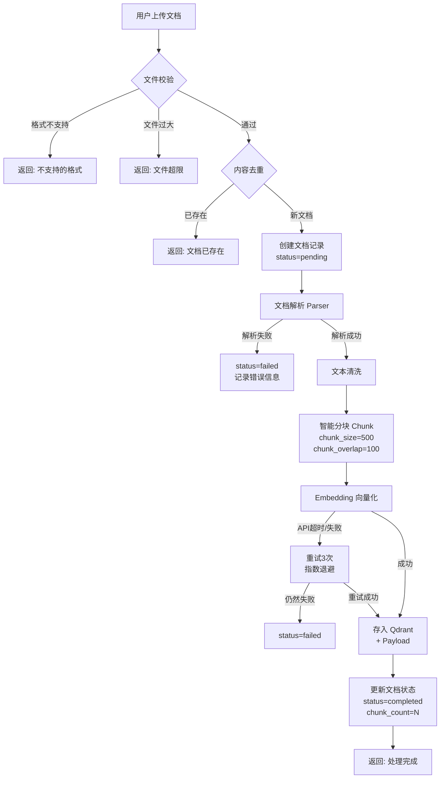
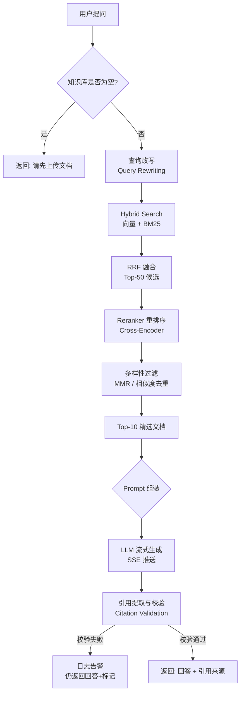

# 企业级智能知识库 RAG — 产品需求文档 (PRD)

> **文档版本**: v1.0
> **创建日期**: 2026年7月10日
> **作者**: RAG 开发团队
> **状态**: Draft → Review → Approved

---

## 目录

1. [产品概述](#1-产品概述)
2. [目标用户画像](#2-目标用户画像)
3. [竞争产品分析](#3-竞争产品分析)
4. [功能需求清单](#4-功能需求清单)
5. [核心业务流程图](#5-核心业务流程图)
6. [角色权限矩阵](#6-角色权限矩阵)
7. [异常场景处理](#7-异常场景处理)
8. [非功能需求](#8-非功能需求)
9. [用户故事](#9-用户故事)
10. [验收标准](#10-验收标准)
11. [产品边界](#11-产品边界)
12. [成功指标](#12-成功指标)

---

## 1. 产品概述

### 1.1 产品定位

**企业级智能知识库（Enterprise Knowledge Base RAG）** 是一款面向中大型企业内部知识管理的 AI 平台。

解决的核心问题：**企业知识散落在 PDF、Word、Markdown 等文档中，员工查找困难、经验无法传承、重复提问浪费人力。**

### 1.2 核心价值主张

| 价值点 | 说明 |
|--------|------|
| **精准检索** | 语义向量检索 + BM25 关键词检索 + Reranker 精排，精准命中答案 |
| **可信回答** | 100% 引用溯源，每个答案都标注来源文档、页码和原文片段 |
| **高效管理** | 多知识库隔离、增量索引、文档生命周期管理 |
| **企业级品质** | DDD 分层架构、RBAC 权限、流式回答、Docker 一键部署 |

### 1.3 产品愿景

成为企业内部知识的 **"统一 AI 入口"**——员工不再需要知道文档存放在哪里，只需要用自然语言提问，即可获得准确、有据可查的答案。

### 1.4 一句话概括

> 把企业的 PDF 文档库，变成一个可以对话的 AI 专家。

---

## 2. 目标用户画像

### 2.1 知识消费者（普通员工）

| 维度 | 描述 |
|------|------|
| **角色** | 公司普通员工，需要查询公司制度、流程、技术文档 |
| **工作场景** | 小王想查年假政策。以前：打开共享盘 → 找到《员工手册.pdf》→ Ctrl+F 搜索 → 可能搜不到（PDF 扫描件）。现在：打开知识库 → 输入"年假有多少天？" → 秒出答案 + 引用来源 |
| **痛点** | 不知道文档放在哪、搜索不准确、找不到人问 |
| **期望** | 像问同事一样自然地提问，快速得到准确答案 |
| **使用频率** | 每日多次 |
| **技术能力** | 基础电脑操作 |

### 2.2 知识管理者（部门助理 / HR / 技术文档工程师）

| 维度 | 描述 |
|------|------|
| **角色** | 负责维护知识库内容，确保文档齐全、信息准确 |
| **工作场景** | 张 HR 需要将新版《考勤制度》上传到知识库。她上传 Word 文档 → 系统自动解析/分块/索引 → 5 分钟后文档状态变为"已完成" → 员工即可查询到最新制度 |
| **痛点** | 文档更新后员工还在问旧版本问题、无法知道哪些文档被使用 |
| **期望** | 上传→自动处理→立即可用，能看到知识库使用统计 |
| **使用频率** | 每周多次 |
| **技术能力** | 熟练使用办公软件 |

### 2.3 系统管理员（IT 运维人员）

| 维度 | 描述 |
|------|------|
| **角色** | 负责系统部署、用户管理、权限分配、性能监控 |
| **工作场景** | 李 IT 需要为新员工创建账号、为财务部创建独立知识库并设置权限。他通过管理后台完成用户管理、权限分配，通过监控面板查看系统运行状态 |
| **痛点** | 权限管理复杂、无法追踪操作记录、出问题难排查 |
| **期望** | 一站式管理后台、详细的操作日志、系统健康监控 |
| **使用频率** | 按需 |
| **技术能力** | 专业技术背景 |

---

## 3. 竞争产品分析

### 3.1 市场对比

| 产品 | 优点 | 缺点 | 与本项目差异 |
|------|------|------|-------------|
| **Dify** | 可视化工作流编排、拖拽式 Prompt 设计、社区活跃 | 权限管理弱（社区版几乎无 RBAC）、企业级功能不足、定制困难 | 本项目：**企业级 RBAC + DDD 分层架构 + 完全可控源码** |
| **FastGPT** | RAG 链路完善、社区版功能较全、文档丰富 | 商业版与社区版差距大、架构耦合度高、二次开发困难 | 本项目：**全开源 + 模块化设计 + 可替换任意组件** |
| **RagFlow** | Pipeline 丰富（深度文档解析）、适合复杂场景 | 上手复杂、部署资源要求高、文档多为英文 | 本项目：**渐进式架构 + 中文优先 + Docker 一键部署** |
| **AnythingLLM** | 极其易用、多 LLM 支持、桌面应用 | 单用户为主、无企业权限、不适合团队协作 | 本项目：**多用户 + 多知识库 + 企业协作** |

### 3.2 本项目的差异化优势

| 维度 | 竞品平均水平 | 本项目 |
|------|-------------|--------|
| 架构 | MVC / 无明确分层 | **DDD 分层架构**（API → Application → Domain → Infrastructure） |
| 权限 | 简单或缺失 | **RBAC 角色权限矩阵**（Viewer / Admin / SuperAdmin） |
| 文档 | API 文档为主 | **12 份完整文档**（PRD + ADR + 测试计划 + 部署手册等） |
| 代码质量 | 不一 | **Black + Ruff + MyPy + 80%+ 测试覆盖率** |
| 检索 | 单一向量检索 | **Hybrid Search（向量+BM25+RRF）+ Reranker 精排** |
| 引用 | 部分支持 | **100% 引用溯源 + 引用完整性校验** |
| 可扩展 | 困难 | **每层可独立替换**（换 Embedding 模型不改业务代码） |

---

## 4. 功能需求清单

### 4.1 P0 — MVP 必须（v1.0，Sprint 1-8）

| ID | 功能模块 | 功能描述 | 优先级 |
|----|---------|---------|--------|
| F-01 | 用户系统 | 用户注册（邮箱+密码）、登录、JWT Token 认证 | P0 |
| F-02 | 用户系统 | Token 自动刷新、安全登出 | P0 |
| F-03 | 知识库 | 创建知识库（名称、描述、分块配置） | P0 |
| F-04 | 知识库 | 知识库列表、更新、删除 | P0 |
| F-05 | 知识库 | 知识库基础权限（所有者 / 只读） | P0 |
| F-06 | 文档管理 | 上传文档（PDF、Markdown、TXT） | P0 |
| F-07 | 文档管理 | 文档列表、查看处理状态、删除 | P0 |
| F-08 | 文档处理 | 自动解析 → 分块 → 向量化 → 存入 Qdrant | P0 |
| F-09 | 文档处理 | 文档状态机（pending → processing → completed → failed） | P0 |
| F-10 | RAG 问答 | 基于知识库的单轮 RAG 问答 | P0 |
| F-11 | RAG 问答 | 流式回答（SSE，逐字显示） | P0 |
| F-12 | RAG 问答 | 回答附带引用来源（文档名、页码、原文片段） | P0 |
| F-13 | RAG 问答 | 知识库无相关内容时明确告知"无法回答" | P0 |
| F-14 | 对话管理 | 创建对话、对话列表、查看历史消息 | P0 |
| F-15 | 基础设施 | Docker Compose 一键部署 | P0 |
| F-16 | 基础设施 | 健康检查接口 + 统一异常/日志/响应 | P0 |

### 4.2 P1 — 重要增强（v1.5，Sprint 9-12）

| ID | 功能模块 | 功能描述 | 优先级 |
|----|---------|---------|--------|
| F-17 | 检索增强 | 混合检索（向量语义 + BM25 关键词 + RRF 融合） | P1 |
| F-18 | 检索增强 | Reranker 精排（Top-50 → Top-10） | P1 |
| F-19 | 对话增强 | 多轮对话上下文理解（追问、指代消解） | P1 |
| F-20 | 权限管理 | RBAC 角色权限（Admin / Editor / Viewer） | P1 |
| F-21 | 用户反馈 | 答案点赞/点踩 + 文字反馈 | P1 |
| F-22 | 文档管理 | 批量上传文档 | P1 |
| F-23 | 文档处理 | Word (.docx) 文档解析 | P1 |
| F-24 | 文档管理 | 文档搜索、按状态/类型筛选 | P1 |
| F-25 | 知识库 | 知识库统计分析（文档数、Chunk 数、问答数） | P1 |
| F-26 | 前端 | 响应式设计、移动端适配 | P1 |

### 4.3 P2 — 企业版（v2.0，Sprint 13-16）

| ID | 功能模块 | 功能描述 | 优先级 |
|----|---------|---------|--------|
| F-27 | 跨知识库 | 跨知识库检索与问答 | P2 |
| F-28 | 分析面板 | 数据看板（问答趋势、热门问题、用户活跃度） | P2 |
| F-29 | 文档处理 | 图片 OCR 识别、HTML 解析 | P2 |
| F-30 | 认证增强 | SSO / OAuth 2.0 集成 | P2 |
| F-31 | 知识图谱 | 实体关系提取与可视化 | P2 |
| F-32 | 审计日志 | 完整操作审计日志（谁在何时做了什么） | P2 |
| F-33 | 开放 API | 对外 API + Rate Limiting + API Key 管理 | P2 |
| F-34 | 通知系统 | Webhook / 邮件通知（文档处理完成、异常告警） | P2 |
| F-35 | 多语言 | 国际化 i18n（中文 / 英文） | P2 |
| F-36 | 高可用 | K8s 部署方案 + 自动扩缩容 | P2 |

---

## 5. 核心业务流程图

### 5.1 文档入库流程



### 5.2 RAG 问答流程



---

## 6. 角色权限矩阵（RBAC）

| 功能 | 普通用户<br/>Viewer | 管理员<br/>Admin | 系统管理员<br/>SuperAdmin |
|------|:---:|:---:|:---:|
| **知识库** | | | |
| 创建知识库 | ✅ | ✅ | ✅ |
| 查看知识库列表 | ✅（自己有权限的） | ✅（自己管理的） | ✅（全部） |
| 更新知识库配置 | ❌ | ✅（自己管理的） | ✅（全部） |
| 删除知识库 | ❌ | ✅（仅自己创建的） | ✅（全部） |
| **成员管理** | | | |
| 查看成员列表 | ✅（同知识库） | ✅（自己管理的） | ✅ |
| 添加/移除成员 | ❌ | ✅（自己管理的） | ✅ |
| 修改成员角色 | ❌ | ❌ | ✅ |
| **文档** | | | |
| 上传文档 | ❌ | ✅（有权限的知识库） | ✅ |
| 查看文档列表 | ✅（有权限的知识库） | ✅（自己管理的） | ✅ |
| 删除文档 | ❌ | ✅（自己管理的知识库） | ✅ |
| **问答** | | | |
| 提问问答 | ✅（有权限的知识库） | ✅ | ✅ |
| 查看对话历史 | ✅（自己的） | ✅（知识库内全部） | ✅ |
| **系统管理** | | | |
| 用户管理 | ❌ | ❌ | ✅ |
| 查看系统日志 | ❌ | ❌ | ✅ |
| 系统配置 | ❌ | ❌ | ✅ |
| 查看统计面板 | ❌ | ✅（自己管理的知识库） | ✅（全部） |

---

## 7. 异常场景处理

### 7.1 文档处理异常

| 场景 | 异常情况 | 系统行为 | 用户提示 |
|------|---------|---------|---------|
| 上传文档 | 文件格式不支持（如 .exe） | 拒绝上传，返回 422 | "不支持的文件类型：.exe。支持的类型：PDF、Markdown、TXT" |
| 上传文档 | 文件大小超过 100MB | 拒绝上传，返回 413 | "文件大小超过限制（最大 100MB），请压缩后重试" |
| 上传文档 | 同一文件重复上传 | 根据 content_hash 去重，返回 409 | "该文档已存在（标题：XXX）。如需更新，请先删除旧版本" |
| PDF 解析 | PDF 文件损坏无法打开 | status=failed, 记录 error_message | "文档解析失败，请检查文件是否完整或尝试重新上传" |
| PDF 解析 | PDF 为扫描件（无文字层） | 提取文字（如有），跳过图片（v1.0 无 OCR） | "文档处理完成。注意：扫描件中的图片内容暂未识别，建议上传可选中文字的 PDF" |
| 文本提取 | 文件内容为空或仅含图片 | status=failed | "文档解析失败：未检测到可提取的文字内容" |
| 分块 | 单段文本超过 chunk_size 上限 | 强制按句子边界切分，记录告警日志 | 正常处理（内部告警） |
| Embedding | API 超时（>30s） | 自动重试 3 次（间隔 2s / 4s / 8s） | 重试中用户无感知；全部失败后标记 failed |
| Embedding | API 返回 Rate Limit | 自动等待 Retry-After 头指示的时间 | 同上 |
| Qdrant 写入 | 连接超时或写入失败 | 回滚 PG 中文档状态，记录错误 | "文档处理失败：系统繁忙，请稍后重试" |
| Qdrant 写入 | 部分 Chunk 写入成功、部分失败 | 全部回滚（事务性），标记 failed | 同上 |

### 7.2 RAG 问答异常

| 场景 | 异常情况 | 系统行为 | 用户提示 |
|------|---------|---------|---------|
| 提问 | 知识库中无任何文档 | 不调用检索和 LLM，直接返回 | "该知识库中暂无文档，请先上传文档" |
| 检索 | 检索结果为空（无相关文档） | 不调用 LLM，直接返回 | "根据现有资料，无法回答这个问题。建议：1) 换个方式提问 2) 检查知识库是否有相关文档" |
| 检索 | Qdrant 服务不可用 | 尝试降级为 PG 全文检索；均失败则返回 503 | "检索服务暂时不可用，请稍后重试" |
| LLM | API Key 无效或过期 | 记录错误，返回 502 | "AI 服务暂不可用，请联系管理员" |
| LLM | 生成内容 Token 超限 | 压缩上下文至 Top-5，仍超限则截断 | "回答基于部分相关内容生成，如需更完整答案请缩小问题范围" |
| LLM | 流式连接中断 | 前端显示已生成内容 + "连接中断"提示 | "回答生成中断，已显示部分内容。请重试" |
| 引用 | 回答中引用了不存在的编号 | 日志告警，仍返回回答 | 后端告警（用户无感知，但会被监控） |
| 引用 | 回答没有引用但声称有答案 | 触发校验失败，标记为可疑 | 同上 |
| 并发 | 同一用户高频提问（>30次/分钟） | Rate Limiter 拦截，返回 429 | "请求过于频繁，请稍后再试" |

### 7.3 认证与权限异常

| 场景 | 异常情况 | 系统行为 | 用户提示 |
|------|---------|---------|---------|
| 登录 | 密码错误超过 5 次 | 锁定账号 15 分钟 | "密码错误次数过多，请 15 分钟后重试" |
| 登录 | 账号不存在 | 统一返回"账号或密码错误"（防枚举） | "账号或密码错误" |
| API 请求 | Token 过期 | 返回 401 + 具体原因 | "登录已过期，请重新登录" |
| API 请求 | Token 被篡改 | 返回 401 | "认证信息无效，请重新登录" |
| API 请求 | 无权限访问知识库 | 返回 403 | "您没有该知识库的访问权限" |
| API 请求 | 尝试删除他人知识库 | 返回 403 | "您没有权限执行此操作" |

---

## 8. 非功能需求

### 8.1 性能需求

| 指标 | 目标值 | 测量方法 |
|------|--------|---------|
| RAG 问答响应时间 | P95 < 15 秒（含 LLM 生成） | 服务端计时 |
| 检索阶段延迟 | P95 < 2 秒 | 服务端计时 |
| 文档处理吞吐 | 50MB PDF < 3 分钟 | 端到端计时 |
| 并发用户数 | 100 并发提问 | 压力测试 |
| 向量检索 QPS | > 50 QPS | Benchmark |
| 首字节时间（TTFB） | < 500ms | 网络监控 |

### 8.2 安全需求

| 需求 | 实现方式 |
|------|---------|
| 传输安全 | HTTPS（生产环境强制） |
| 认证机制 | JWT Access Token（24h）+ Refresh Token（7天） |
| 密码存储 | bcrypt 哈希（cost factor ≥ 12） |
| API Key 存储 | AES-256 加密存储 |
| SQL 注入防护 | SQLAlchemy 参数化查询（100%） |
| XSS 防护 | 前端输出编码 + CSP Header |
| CSRF 防护 | SameSite Cookie + CSRF Token |
| 数据隔离 | 用户只能访问有权访问的知识库（Repository 层强制过滤） |
| 日志脱敏 | 密码、Token、API Key 等敏感信息不写入日志 |
| 速率限制 | 基于 Redis 的 Token Bucket 算法 |

### 8.3 可维护性需求

| 指标 | 目标值 |
|------|--------|
| 代码测试覆盖率 | 核心业务逻辑 ≥ 80% |
| 类型注解覆盖 | 所有公共函数 100% |
| API 文档 | Swagger + ReDoc + 手写 API.md |
| 架构文档 | C4 Model + 时序图 + ADR |
| 代码风格 | Black + Ruff + MyPy 零告警 |
| 日志规范 | 结构化日志，关键节点全覆盖 |

### 8.4 可靠性需求

| 指标 | 目标值 |
|------|--------|
| 服务可用性 | ≥ 99.5%（月维度） |
| 数据持久性 | ≥ 99.99%（PG WAL + Qdrant Snapshot） |
| RPO（恢复点目标） | < 1 小时（数据库） |
| RTO（恢复时间目标） | < 4 小时 |

### 8.5 可扩展性需求

- 无状态 API 服务：支持水平扩展（多副本 + 负载均衡）
- 向量数据库：Qdrant 支持集群模式（v2.0）
- 配置热更新：Pydantic Settings 支持环境变量覆盖
- 模块可替换：Embedding / LLM / Reranker 均通过接口抽象

---

## 9. 用户故事

### 9.1 知识消费者故事

**US-01: 自然语言问答**
> 作为**知识消费者**，我希望**输入自然语言问题**，系统能**基于知识库文档返回准确回答并标注引用来源**。
>
> **验收标准**：
> - Given 知识库"员工手册"中有年假相关文档
> - When 我提问"公司年假有多少天？"
> - Then 系统在 15 秒内返回包含具体天数的回答
> - And 回答中标注引用编号 [1]
> - And 我可以点击引用查看原文片段

**US-02: 流式回答体验**
> 作为**知识消费者**，我希望**看到回答是逐字生成的**，而不是等待全部完成才显示。
>
> **验收标准**：
> - Given 我提交了一个问题
> - When 系统开始生成回答
> - Then 前端逐字显示回答内容（SSE 流式）
> - And 首字显示在 2 秒内出现

**US-03: 多轮对话追问**
> 作为**知识消费者**，我希望**在对话中基于上下文追问**，系统能理解我的意图。
>
> **验收标准**：
> - Given 我刚问了"公司年假有多少天？"并得到回答
> - When 我追问"怎么申请呢？"
> - Then 系统理解我指的是年假申请流程
> - And 不需要我再次指定"年假"关键词

**US-04: 诚实回答**
> 作为**知识消费者**，当知识库中**没有相关资料时**，我希望系统**明确告知无法回答**，而不是编造内容。
>
> **验收标准**：
> - Given 知识库中没有关于"生育津贴"的任何文档
> - When 我提问"公司生育津贴怎么领？"
> - Then 系统回答"根据现有资料，无法回答这个问题"
> - And 不会编造任何虚假信息

**US-05: 引用溯源**
> 作为**知识消费者**，我希望看到**每条回答都有据可查**，能追溯到原始文档。
>
> **验收标准**：
> - Given 系统返回了 RAG 回答
> - When 我查看回答
> - Then 每个关键事实后都有引用标记 [N]
> - And 回答末尾或侧边栏显示完整的引用列表
> - And 每条引用包含：文档名称、页码（如有）、原文片段

### 9.2 知识管理者故事

**US-06: 上传文档自动处理**
> 作为**知识管理者**，我希望**上传文档后系统自动完成解析、分块和索引**，无需手动干预。
>
> **验收标准**：
> - Given 我上传了一份 PDF 文档
> - When 上传完成
> - Then 系统自动开始处理（解析→分块→向量化→索引）
> - And 我可以在文档列表中看到处理状态变化
> - And 处理完成后我收到通知（列表状态更新）

**US-07: 文档状态跟踪**
> 作为**知识管理者**，我希望在文档列表中**看到每个文档的处理状态**。
>
> **验收标准**：
> - Given 我进入了知识库的文档列表
> - When 我查看列表
> - Then 每个文档显示状态标签：处理中 / 已完成 / 失败
> - And 失败的文档显示错误原因
> - And 我可以对失败的文档执行重试

**US-08: 多知识库管理**
> 作为**知识管理者**，我希望**创建多个知识库**，将不同部门或主题的文档分开管理。
>
> **验收标准**：
> - Given 我管理"HR制度"和"技术文档"两个领域
> - When 我创建两个知识库
> - Then 两个知识库的文档隔离存储
> - And 在"HR制度"中提问不会检索到"技术文档"的内容
> - And 两个知识库可以有不同的分块配置

**US-09: 知识库统计**
> 作为**知识管理者**，我希望看到**知识库的使用统计**。
>
> **验收标准**：
> - Given 我是知识库管理员
> - When 我进入知识库详情
> - Then 可以看到：文档总数、Chunk 总数、问答总次数
> - And 可以看到最近 7 天的问答趋势

**US-10: 文档删除同步**
> 作为**知识管理者**，当我删除文档时，**相关的向量数据也应被同步清理**。
>
> **验收标准**：
> - Given 我删除了一份已索引的文档
> - When 删除操作完成
> - Then 文档的 PG 记录被软删除（status=deleted）
> - And Qdrant 中对应的向量被同步删除
> - And 后续检索不再返回该文档的内容

### 9.3 系统管理员故事

**US-11: 用户与权限管理**
> 作为**系统管理员**，我希望能**管理所有用户并分配权限**。
>
> **验收标准**：
> - Given 我是 SuperAdmin
> - When 我进入用户管理页面
> - Then 可以看到所有用户列表
> - And 可以禁用/启用用户账号
> - And 可以为知识库添加/移除成员并设置角色

**US-12: 系统监控**
> 作为**系统管理员**，我希望**监控系统运行状态和 API 调用情况**。
>
> **验收标准**：
> - Given 我进入系统管理后台
> - When 我查看监控面板
> - Then 可以看到：服务健康状态、API 调用量、错误率
> - And 可以看到最近的错误日志
> - And 异常情况会触发告警（v2.0）

---

## 10. 验收标准

### 10.1 MVP 上线验收

**功能验收**：
- [ ] 用户可以注册、登录、Token 自动刷新
- [ ] 用户可以创建/查看/更新/删除知识库
- [ ] 用户可以上传 PDF/Markdown/TXT 文档并自动完成处理
- [ ] 用户可以在知识库中提问并获得流式回答
- [ ] 回答附带引用来源并能点击查看原文
- [ ] 无相关文档时系统明确告知"无法回答"
- [ ] 用户可以查看对话历史
- [ ] 知识库所有者可以管理成员（添加/移除）

**非功能验收**：
- [ ] SSH 流式回答首字时间 < 2 秒
- [ ] 完整回答时间 P95 < 15 秒
- [ ] 所有 API 有 Swagger 文档
- [ ] Docker Compose 一键启动所有服务
- [ ] 单元测试覆盖率 ≥ 80%
- [ ] Black + Ruff + MyPy 零告警

### 10.2 质量门禁

上线前必须全部通过：

1. ✅ 所有 P0 功能已实现并通过测试
2. ✅ 无 Critical / High 级别的 Bug
3. ✅ 安全扫描通过（Bandit + 手动检查）
4. ✅ 性能测试达标（100 并发）
5. ✅ 文档已更新（PRD / ARCHITECTURE / API / DATABASE）
6. ✅ Code Review 完成

---

## 11. 产品边界

### 11.1 MVP（v1.0）范围

**包含**：
- 用户注册/登录 + JWT 认证
- 知识库 CRUD + 基础权限
- 文档上传（PDF/Markdown/TXT）+ 自动处理
- 单知识库 RAG 问答（流式 SSE）
- 回答引用来源
- 对话历史管理
- Docker Compose 一键部署

**不包含**：
- ❌ 混合检索（BM25 + RRF）→ 向量检索先行，混合检索 v1.5
- ❌ 重排序（Reranker）→ v1.5
- ❌ RBAC 细粒度权限 → v1.5
- ❌ 多轮对话上下文 → v1.5
- ❌ 批量上传文档 → v1.5
- ❌ OCR 图片识别 → v2.0
- ❌ 跨知识库问答 → v2.0
- ❌ SSO/OAuth → v2.0
- ❌ 知识图谱 → v2.0
- ❌ 数据分析面板 → v2.0
- ❌ Word 文档解析 → P1 评估，优先支持后可能提前

### 11.2 版本演进路径

```
v1.0 MVP (Sprint 1-8, 16周)
  ├── 用户 + 知识库 + 文档
  ├── 向量检索 + LLM 问答
  └── Docker 部署
        ↓
v1.5 增强版 (Sprint 9-12, 8周)
  ├── 混合检索 + Reranker
  ├── RBAC + 多轮对话
  └── 用户反馈 + 批量上传
        ↓
v2.0 企业版 (Sprint 13-16, 8周)
  ├── 跨知识库 + SSO
  ├── 数据面板 + 审计日志
  └── 知识图谱 + K8s 部署
```

---

## 12. 成功指标

### 12.1 产品指标

| 指标 | 目标值 | 测量方式 |
|------|--------|---------|
| 答案准确率（用户点赞率） | > 85% | 点赞/(点赞+点踩) |
| 平均问答响应时间 | < 10 秒 | 服务端统计 |
| 文档处理成功率 | > 99% | 完成数/上传总数 |
| 检索命中率（Recall@5） | > 90% | 标注测试集 |
| 引用准确率（Citation Precision） | > 98% | 自动校验 |

### 12.2 用户指标

| 指标 | 目标值 | 测量方式 |
|------|--------|---------|
| 月活跃用户数 | — | 基准线建立后设定 |
| 月活用户留存率 | > 60% | 本月活跃 / 上月活跃 |
| 平均每用户日提问数 | > 3 次 | 系统统计 |
| 用户满意度 NPS | > 50 | 问卷调查 |

### 12.3 技术指标

| 指标 | 目标值 |
|------|--------|
| 服务可用性 | ≥ 99.5% |
| API 错误率 | < 0.1% |
| 测试覆盖率 | ≥ 80% |
| Deployment 频率 | 每 Sprint 至少 1 次 |

---

> **下一步**: 阅读 [技术架构设计 (ARCHITECTURE.md)](./ARCHITECTURE.md) 了解系统的技术实现方案。
