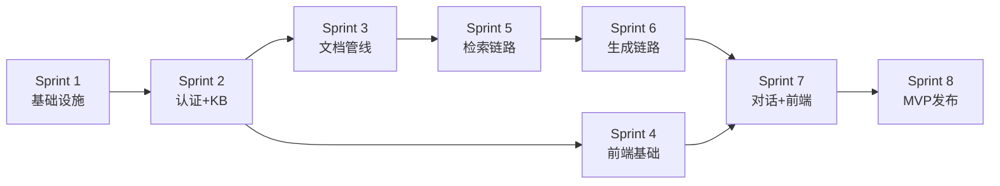

# 企业级智能知识库 RAG — 详细任务拆分 (Tasks)

> **文档版本**: v1.0
> **创建日期**: 2026年7月10日
> **关联文档**: [ROADMAP.md](./ROADMAP.md) | [PRD.md](./PRD.md)
> **总任务数**: 约 124 个 | **预估总工时**: 约 211 小时

---

## 目录

1. [任务管理说明](#1-任务管理说明)
2. [Sprint 1：项目初始化与基础设施](#2-sprint-1项目初始化与基础设施)
3. [Sprint 2：认证与知识库管理](#3-sprint-2认证与知识库管理)
4. [Sprint 3：文档处理管线](#4-sprint-3文档处理管线)
5. [Sprint 4：文档管理与前端基础](#5-sprint-4文档管理与前端基础)
6. [Sprint 5：RAG 检索链路](#6-sprint-5rag-检索链路)
7. [Sprint 6：RAG 生成链路](#7-sprint-6rag-生成链路)
8. [Sprint 7：对话与前端问答界面](#8-sprint-7对话与前端问答界面)
9. [Sprint 8：MVP 收尾与部署](#9-sprint-8mvp-收尾与部署)
10. [Sprint 总览与工时统计](#10-sprint-总览与工时统计)

---

## 1. 任务管理说明

### 1.1 字段说明

| 字段 | 说明 |
|------|------|
| **ID** | 唯一标识，格式：`Sprint序号.Task序号` |
| **P** | Priority：P0=阻塞/必须, P1=重要/本周, P2=增强/下个Sprint |
| **SP** | Story Point：1=简单(<1h), 2=中等(1-2h), 3=复杂(2-3h), 5=需拆解(>3h) |
| **工时** | 预估小时数 |
| **Owner** | 负责角色：Backend / Frontend / AI / DevOps / FullStack |
| **依赖** | 前置 Task ID |
| **验收标准** | 如何判断该 Task 完成 |

### 1.2 Task 之间依赖关系

---

## 2. Sprint 1：项目初始化与基础设施

> **时间**: 第 1-2 周 | **任务数**: 19 | **预估工时**: 30h

| ID | P | Task | SP | 工时 | Owner | 依赖 | 验收标准 |
|----|---|------|-----|------|-------|------|---------|
| 1.1 | P0 | 创建项目目录结构 | 1 | 1h | Backend | - | 符合 ARCHITECTURE.md 定义的目录，所有 `__init__.py` 就位 |
| 1.2 | P0 | 初始化 pyproject.toml | 1 | 1h | Backend | 1.1 | `black --check .`、`ruff check .`、`mypy app/` 全部通过 |
| 1.3 | P0 | 实现 Pydantic Settings（7个配置类） | 2 | 1.5h | Backend | 1.1 | `.env` 读取正常，缺失必填项启动报错，类型校验正确 |
| 1.4 | P0 | 创建 .env.template | 1 | 0.5h | Backend | 1.3 | 所有环境变量有中文注释，敏感值标记为 `<your-xxx>` |
| 1.5 | P0 | 实现统一异常体系 | 2 | 2h | Backend | 1.1 | 7 个异常子类均可正确创建并传递 code/message/detail |
| 1.6 | P0 | 实现统一日志系统 | 2 | 1.5h | Backend | 1.1 | `get_logger(__name__)` 返回结构化 Logger，INFO/ERROR 级别控制正常 |
| 1.7 | P0 | 实现统一响应模型 | 2 | 2h | Backend | 1.1 | `APIResponse[T]`、`PaginatedResponse[T]`、`PageInfo` 序列化/反序列化正确 |
| 1.8 | P0 | 实现全局异常处理器 | 2 | 1.5h | Backend | 1.5, 1.7 | AppException 返回统一格式，未知异常返回 500 且不泄露内部信息 |
| 1.9 | P0 | 配置 SQLAlchemy 异步引擎 | 2 | 2h | Backend | 1.3 | `async_sessionmaker` 可用，连接池参数正确（pool_size=20） |
| 1.10 | P0 | 配置 Alembic | 2 | 1.5h | Backend | 1.9 | `alembic init` + `alembic upgrade head` 成功，env.py 使用异步引擎 |
| 1.11 | P0 | 配置 Docker Compose（PG+Qdrant+Redis） | 2 | 2h | DevOps | 1.3 | `docker compose up -d` 三服务启动，healthcheck 通过 |
| 1.12 | P0 | 创建 FastAPI 应用入口 | 2 | 1.5h | Backend | 1.8 | `uvicorn app.main:app` 启动，Swagger UI 可访问 |
| 1.13 | P0 | 实现健康检查接口 | 1 | 0.5h | Backend | 1.12, 1.11 | `GET /health` 返回 DB/Redis/Qdrant 三服务连通状态 |
| 1.14 | P0 | 添加 CORS 中间件 | 1 | 0.5h | Backend | 1.12 | 开发环境允许 `localhost:3000`，生产环境限制为实际域名 |
| 1.15 | P0 | 添加 Request ID 中间件 | 1 | 1h | Backend | 1.12 | 请求头 `X-Request-ID` 贯穿日志和响应头 |
| 1.16 | P0 | 实现数据库会话依赖注入 | 2 | 1.5h | Backend | 1.9 | `get_db()` 正确 yield session，异常时自动 rollback，finally close |
| 1.17 | P0 | 创建初始 Alembic Migration（空基线） | 1 | 0.5h | Backend | 1.10 | `alembic revision --autogenerate -m "initial"` 生成基线迁移 |
| 1.18 | P1 | 配置 GitHub Actions CI | 2 | 2h | DevOps | 1.2 | PR 自动运行 black/ruff/mypy/pytest，失败阻止合并 |
| 1.19 | P1 | 编写基础单元测试 | 2 | 2h | Backend | 1.8, 1.7 | 异常处理器和响应模型测试通过，覆盖率基线建立 |

---

## 3. Sprint 2：认证与知识库管理

> **时间**: 第 3-4 周 | **任务数**: 15 | **预估工时**: 25h

| ID | P | Task | SP | 工时 | Owner | 依赖 | 验收标准 |
|----|---|------|-----|------|-------|------|---------|
| 2.1 | P0 | 创建 users 表 Migration | 2 | 1h | Backend | 1.17 | 字段与 DATABASE.md 一致，含 ENUM 类型和 CHECK 约束 |
| 2.2 | P0 | 创建 knowledge_bases 表 Migration | 2 | 1h | Backend | 1.17 | 字段完整，chunk_size CHECK 约束 500-800 |
| 2.3 | P0 | 创建 kb_members 表 Migration | 2 | 1h | Backend | 2.1, 2.2 | 联合唯一约束 (kb_id, user_id)，级联删除 |
| 2.4 | P0 | 实现 User ORM 模型 | 2 | 1h | Backend | 2.1 | 字段映射正确，relationship 定义 |
| 2.5 | P0 | 实现 KB + KBMember ORM 模型 | 2 | 1h | Backend | 2.2, 2.3 | 关联关系正确 |
| 2.6 | P0 | 实现密码哈希工具 | 1 | 1h | Backend | - | bcrypt hash(cost=12) + verify，含单元测试 |
| 2.7 | P0 | 实现 JWT Token 工具 | 2 | 2h | Backend | 1.3 | access_token(24h)+refresh_token(7d)，encode/decode 正确 |
| 2.8 | P0 | 实现 UserRepository | 2 | 2h | Backend | 2.4 | CRUD + findByEmail + findByUsername + 分页 |
| 2.9 | P0 | 实现 KBRepository | 2 | 2h | Backend | 2.5 | CRUD + 成员管理 + 按 owner 查询 + 分页 |
| 2.10 | P0 | 实现 AuthService | 3 | 3h | Backend | 2.6, 2.7, 2.8 | register（去重）/ login（校验）/ refresh / get_me |
| 2.11 | P0 | 实现 KBService | 3 | 3h | Backend | 2.9 | create/list/detail/update/delete + 权限校验 + 成员管理 |
| 2.12 | P0 | 实现认证 API（4 个端点） | 2 | 2h | Backend | 2.10 | POST register/login/refresh + GET me，Swagger 文档完整 |
| 2.13 | P0 | 实现知识库 API（6 个端点） | 3 | 3h | Backend | 2.11 | CRUD + 成员管理，统一响应格式，需认证 |
| 2.14 | P0 | 实现 JWT 认证中间件 | 2 | 2h | Backend | 2.7 | `Depends(get_current_user)` → 注入 User，未认证返回 401 |
| 2.15 | P1 | 编写 Sprint 2 单元测试 | 2 | 2h | Backend | 2.12, 2.13 | AuthService 覆盖率 > 90%，KBService 覆盖率 > 85% |

---

## 4. Sprint 3：文档处理管线

> **时间**: 第 5-6 周 | **任务数**: 16 | **预估工时**: 28h

| ID | P | Task | SP | 工时 | Owner | 依赖 | 验收标准 |
|----|---|------|-----|------|-------|------|---------|
| 3.1 | P0 | 创建 documents 表 Migration | 2 | 1h | Backend | 1.17 | doc_type/doc_status ENUM，content_hash unique 约束 |
| 3.2 | P0 | 创建 document_chunks 表 Migration | 2 | 1h | Backend | 3.1 | (document_id, chunk_index) 联合唯一 |
| 3.3 | P0 | 实现 Document + Chunk ORM 模型 | 2 | 1h | Backend | 3.1, 3.2 | 关联关系，字段映射 |
| 3.4 | P0 | 实现 DocumentRepository | 2 | 2h | Backend | 3.3 | CRUD + 去重（content_hash）+ 状态筛选 + 分页 |
| 3.5 | P0 | 实现 ChunkRepository | 2 | 2h | Backend | 3.3 | 批量插入（bulk_insert）+ 按文档查询 + 按 KB 查询 |
| 3.6 | P0 | 实现 BaseParser 抽象接口 | 1 | 0.5h | AI | - | `parse(file_path) → str` 统一接口 |
| 3.7 | P0 | 实现 PDFParser | 2 | 2h | AI | 3.6 | PyMuPDF 提取文字，支持加密 PDF 检测 |
| 3.8 | P0 | 实现 MarkdownParser | 2 | 1.5h | AI | 3.6 | 保留标题层级，代码块完整 |
| 3.9 | P0 | 实现 TextParser | 1 | 0.5h | AI | 3.6 | 纯文本读取，UTF-8/GBK 编码检测 |
| 3.10 | P0 | 实现 ParserRegistry | 1 | 1h | AI | 3.7, 3.8, 3.9 | 根据文件类型自动选择解析器 |
| 3.11 | P0 | 实现 TextSplitter（含 TokenCounter） | 3 | 3h | AI | - | RecursiveCharacterTextSplitter(chunk_size=500, overlap=100)，tiktoken 计数 |
| 3.12 | P0 | 实现 validate_chunks() | 1 | 1h | AI | 3.11 | 空 chunk 过滤、过长告警、重叠验证 |
| 3.13 | P0 | 实现 EmbeddingClient | 2 | 2h | AI | - | OpenAI Compatible API，单条/批量向量化，重试机制 |
| 3.14 | P0 | 实现 QdrantClient 封装 | 2 | 2h | AI | 1.11 | create_collection / upsert / search / delete_points |
| 3.15 | P0 | 实现 DocumentService（上传编排） | 3 | 3h | Backend | 3.4, 3.5, 3.10, 3.11, 3.13, 3.14 | upload() → 去重 → 创建记录 → 入队异步处理 |
| 3.16 | P1 | 实现文档处理 Worker（异步任务） | 3 | 3h | Backend | 3.15 | 从队列取任务 → 解析 → 分块 → 向量化 → Qdrant → 更新状态 |
| 3.17 | P0 | 实现文档 API（5 个端点） | 2 | 2h | Backend | 3.15 | 上传/列表/详情/删除/重处理，统一响应格式 |

---

## 5. Sprint 4：文档管理与前端基础

> **时间**: 第 7-8 周 | **任务数**: 18 | **预估工时**: 30h

| ID | P | Task | SP | 工时 | Owner | 依赖 | 验收标准 |
|----|---|------|-----|------|-------|------|---------|
| 4.1 | P0 | 实现文档搜索/筛选 API 增强 | 2 | 2h | Backend | 3.17 | 按 status/file_type/keyword 组合筛选 + 排序 |
| 4.2 | P0 | 实现知识库统计 API | 2 | 1.5h | Backend | 3.17 | 返回 doc_count / chunk_count / total_questions |
| 4.3 | P0 | 实现知识库成员管理 API 完善 | 2 | 1.5h | Backend | 2.13 | 添加/移除/修改角色/列表 |
| 4.4 | P0 | 初始化 React 项目（Vite + TS + TailwindCSS） | 2 | 2h | Frontend | - | `npm run dev` 启动，TailwindCSS 生效 |
| 4.5 | P0 | 配置 React Router + 路由结构 | 2 | 1.5h | Frontend | 4.4 | `/login`, `/register`, `/kbs`, `/kbs/:id`, `/chat/:convId` |
| 4.6 | P0 | 实现 API Client 封装（axios） | 2 | 1.5h | Frontend | 4.4 | Token 自动附加、401 自动刷新、统一错误处理 |
| 4.7 | P0 | 实现 AuthContext（状态管理） | 2 | 2h | Frontend | 4.6 | 登录状态持久化、Token 管理、自动刷新 |
| 4.8 | P0 | 实现登录页面 | 2 | 2h | Frontend | 4.6, 4.7 | 表单校验、错误提示、登录后跳转 |
| 4.9 | P0 | 实现注册页面 | 2 | 1.5h | Frontend | 4.6 | 表单校验（密码强度、邮箱格式）、注册后自动登录 |
| 4.10 | P0 | 实现知识库列表页面 | 2 | 2h | Frontend | 4.6, 4.7 | 卡片展示、搜索、创建弹窗 |
| 4.11 | P0 | 实现知识库详情页面 | 2 | 2h | Frontend | 4.10 | 文档列表 + 统计信息 |
| 4.12 | P0 | 实现文档上传组件 | 2 | 2h | Frontend | 4.11 | 拖拽上传、进度条、格式校验、成功/失败提示 |
| 4.13 | P1 | 实现布局组件（Header + Sidebar） | 2 | 2h | Frontend | 4.5 | 导航菜单、用户信息、登出按钮 |
| 4.14 | P1 | 实现 Protected Route 组件 | 1 | 1h | Frontend | 4.7 | 未登录重定向到登录页 |
| 4.15 | P1 | 实现分页组件 | 1 | 1h | Frontend | - | 可复用的分页 UI |
| 4.16 | P1 | 实现 Loading / Empty / Error 状态组件 | 2 | 1.5h | Frontend | - | 三种通用状态组件 |
| 4.17 | P1 | 实现文档状态标签组件 | 1 | 1h | Frontend | 4.11 | pending=黄色/processing=蓝色/completed=绿色/failed=红色 |
| 4.18 | P1 | 编写前端 E2E 测试（登录+KB列表） | 2 | 2h | Frontend | 4.8, 4.10 | Playwright 基础测试，覆盖核心路径 |

---

## 6. Sprint 5：RAG 检索链路

> **时间**: 第 9-10 周 | **任务数**: 14 | **预估工时**: 24h

| ID | P | Task | SP | 工时 | Owner | 依赖 | 验收标准 |
|----|---|------|-----|------|-------|------|---------|
| 5.1 | P0 | 实现 QueryRewriter | 3 | 3h | AI | 2.7 (LLM) | LLM-based，输入口语化问题 → 输出检索优化查询 |
| 5.2 | P0 | 创建查询改写 Prompt 模板 | 2 | 1.5h | AI | 5.1 | PromptRegistry 注册，含改写规则和输出格式 |
| 5.3 | P0 | 实现 QdrantRetriever（封装检索） | 2 | 2h | AI | 3.14 | search() 含 Payload 过滤（kb_id），返回 Top-50 |
| 5.4 | P0 | 实现 Reranker（bge-reranker-v2-m3） | 3 | 3h | AI | - | Cross-Encoder 打分，50条 → 10条，含延迟测试 |
| 5.5 | P0 | 实现 DiversityFilter | 2 | 2h | AI | 5.4 | 余弦相似度去重（threshold=0.95） |
| 5.6 | P0 | 实现 RetrievalPipeline 编排 | 3 | 3h | AI | 5.1, 5.3, 5.4, 5.5 | 串联：改写→向量检索→重排序→去重 |
| 5.7 | P0 | 实现 SearchService（检索服务） | 2 | 2h | Backend | 5.6 | 封装 RetrievalPipeline，供 API 和 RAG 内部调用 |
| 5.8 | P0 | 实现检索 API | 2 | 1.5h | Backend | 5.7 | POST /search 返回相关文档列表（不含 LLM 生成） |
| 5.9 | P1 | 准备检索标注数据集 | 2 | 2h | AI | - | 10+ 个查询 + 人工标注相关文档，用于评估 |
| 5.10 | P1 | 实现检索效果评估脚本 | 2 | 2h | AI | 5.9, 5.7 | Recall@5 / MRR / Hit Rate 计算 |
| 5.11 | P1 | 检索参数调优 | 2 | 2h | AI | 5.10 | 调整 top_k / 相似度阈值，优化 Recall@5 |
| 5.12 | P1 | 实现查询改写效果评估 | 1 | 1h | AI | 5.1 | 人工对比改写前后检索效果 |
| 5.13 | P1 | 编写检索模块单元测试 | 2 | 2h | Backend | 5.6 | QueryRewriter / Reranker / DiversityFilter 测试 |
| 5.14 | P1 | 编写检索 API 集成测试 | 2 | 1.5h | Backend | 5.8 | 上传文档→检索→验证召回结果 |

---

## 7. Sprint 6：RAG 生成链路

> **时间**: 第 11-12 周 | **任务数**: 14 | **预估工时**: 26h

| ID | P | Task | SP | 工时 | Owner | 依赖 | 验收标准 |
|----|---|------|-----|------|-------|------|---------|
| 6.1 | P0 | 实现 LLMClient（OpenAI Compatible） | 3 | 3h | AI | - | 支持生成 + 流式生成，含重试（3次）+ 超时控制 |
| 6.2 | P0 | 实现 PromptRegistry | 2 | 2h | AI | - | 模板注册/获取/渲染，变量校验 |
| 6.3 | P0 | 创建 RAG System Prompt 模板 | 2 | 1.5h | AI | 6.2 | 含引用强制要求、角色定位、拒绝编造 |
| 6.4 | P0 | 创建 RAG User Prompt 模板 | 1 | 1h | AI | 6.2 | Context + Question 组装格式 |
| 6.5 | P0 | 实现 PromptBuilder | 2 | 2h | AI | 6.3, 6.4 | 上下文截断 + 格式化 + 编号 + System+User 组装 |
| 6.6 | P0 | 实现 CitationValidator | 3 | 3h | AI | - | 提取 [N] 引用 → 校验在 context 中存在 → 校验内容匹配 |
| 6.7 | P0 | 实现 RAGPipeline（完整 7 步编排） | 3 | 3h | AI | 5.6, 6.1, 6.5, 6.6 | Query→Rewrite→Retrieve→Rerank→Prompt→LLM→Validate |
| 6.8 | P0 | 实现 RAG API — 流式 SSE | 3 | 3h | Backend | 6.7 | POST /kb/{id}/chat，SSE event: token/citation/done/error |
| 6.9 | P1 | 实现 RAG API — 非流式 | 2 | 1.5h | Backend | 6.7 | POST /kb/{id}/chat/sync，返回完整 JSON 响应 |
| 6.10 | P1 | 实现 RAG 回答质量检查 | 2 | 2h | AI | 6.6 | 检查：幻觉检测、引用完整性、格式正确性 |
| 6.11 | P1 | 实现 RAG Error 事件处理 | 2 | 1.5h | Backend | 6.8 | 知识库为空/检索无结果/LLM超时 等场景的 SSE error event |
| 6.12 | P1 | 实现日志与 Metrics 埋点 | 2 | 2h | Backend | 6.7 | 每步耗时记录、检索候选数、Token 消耗、错误率 |
| 6.13 | P1 | 编写 RAG Pipeline 单元测试 | 2 | 2h | Backend | 6.7 | Mock LLM 和检索，测试管线编排正确性 |
| 6.14 | P1 | 编写 RAG API 集成测试 | 2 | 1.5h | Backend | 6.8, 6.9 | 端到端：提问→流式回答→引用完整 |

---

## 8. Sprint 7：对话与前端问答界面

> **时间**: 第 13-14 周 | **任务数**: 16 | **预估工时**: 28h

| ID | P | Task | SP | 工时 | Owner | 依赖 | 验收标准 |
|----|---|------|-----|------|-------|------|---------|
| 7.1 | P0 | 创建 conversations 表 Migration | 2 | 1h | Backend | 1.17 | 字段与 DATABASE.md 一致 |
| 7.2 | P0 | 创建 messages 表 Migration | 2 | 1h | Backend | 7.1 | 含 JSONB citations/token_usage，feedback ENUM |
| 7.3 | P0 | 实现 Conversation + Message ORM 模型 | 2 | 1h | Backend | 7.1, 7.2 | |
| 7.4 | P0 | 实现 ConversationRepository | 2 | 2h | Backend | 7.3 | CRUD + 按用户/KB 查询 + 分页 |
| 7.5 | P0 | 实现 ConversationService | 2 | 2h | Backend | 7.4 | 创建会话、列表、详情、删除、归档 |
| 7.6 | P0 | 实现对话 API（5 个端点） | 2 | 2h | Backend | 7.5 | 与 API.md 定义一致 |
| 7.7 | P0 | 实现消息反馈 API | 1 | 1h | Backend | 7.2 | POST /messages/{id}/feedback，支持 positive/negative/null |
| 7.8 | P0 | 实现前端问答页面（Chat UI） | 3 | 3h | Frontend | 4.6, 6.8 | 消息列表 + 输入框 + 发送按钮 |
| 7.9 | P0 | 实现 SSE 流式接收组件 | 3 | 3h | Frontend | 7.8 | EventSource 接收 SSE，逐字显示 |
| 7.10 | P0 | 实现 Markdown 渲染组件 | 2 | 1.5h | Frontend | 7.8 | react-markdown + 代码高亮 |
| 7.11 | P0 | 实现引用卡片组件 | 2 | 2h | Frontend | 7.8 | 侧边栏/弹窗展示引用来源（文档名、页码、片段） |
| 7.12 | P0 | 实现对话历史侧边栏 | 2 | 2h | Frontend | 7.6, 7.8 | 对话列表 + 切换 + 新建对话 |
| 7.13 | P1 | 实现反馈按钮（点赞/点踩） | 1 | 1h | Frontend | 7.7 | 点击后调用反馈 API |
| 7.14 | P1 | 实现知识库选择器 | 2 | 1.5h | Frontend | 7.8 | 问答前选择目标知识库 |
| 7.15 | P1 | 实现空状态引导 | 1 | 1h | Frontend | 7.8 | 无文档时显示引导"请先上传文档" |
| 7.16 | P1 | 编写对话 API 集成测试 | 2 | 2h | Backend | 7.6 | 创建对话→提问→验证消息存储→查询历史 |

---

## 9. Sprint 8：MVP 收尾与部署

> **时间**: 第 15-16 周 | **任务数**: 12 | **预估工时**: 20h

| ID | P | Task | SP | 工时 | Owner | 依赖 | 验收标准 |
|----|---|------|-----|------|-------|------|---------|
| 8.1 | P0 | 前后端全链路联调 | 3 | 3h | FullStack | 全部 | 12 个 P0 User Story 手动验证通过 |
| 8.2 | P0 | 数据库查询性能优化 | 2 | 2h | Backend | 8.1 | 消除 N+1 查询，慢查询 < 100ms |
| 8.3 | P0 | 检索延迟优化 | 2 | 2h | AI | 8.1 | 检索阶段 P95 < 2s |
| 8.4 | P0 | Dockerfile 多阶段构建 | 2 | 2h | DevOps | 8.1 | API + Worker 镜像构建成功，大小优化 |
| 8.5 | P0 | docker-compose.prod.yml | 2 | 2h | DevOps | 8.4 | 生产环境编排：Nginx + API×2 + Worker + PG + Qdrant + Redis |
| 8.6 | P0 | Nginx 生产配置 | 2 | 2h | DevOps | 8.5 | 反向代理 + 静态资源 + 限流（30r/m）+ Gzip |
| 8.7 | P0 | 一键部署脚本 | 2 | 1.5h | DevOps | 8.5 | start.sh（Linux/Mac）+ start.ps1（Windows） |
| 8.8 | P0 | 全量单元测试 + 覆盖率检查 | 2 | 2h | Backend | 8.1 | 覆盖率 ≥ 80%，所有测试通过 |
| 8.9 | P1 | 性能压测 | 2 | 2h | DevOps | 8.5 | 100 并发 RAG 问答，P95 < 15s |
| 8.10 | P1 | 文档一致性审核 | 2 | 2h | FullStack | 全部 | PRD/ARCH/API/DATABASE/ROADMAP/TASKS 一致性检查 |
| 8.11 | P1 | 编写 CHANGELOG v1.0.0 | 1 | 1h | Backend | 8.1 | All notable changes documented |
| 8.12 | P1 | 创建 v1.0.0 Git Tag + Release Notes | 1 | 0.5h | DevOps | 8.11 | Tag 推送，Release Notes 包含功能列表和部署说明 |

---

## 10. Sprint 总览与工时统计

### 10.1 工时汇总

| Sprint | 主题 | Task 数 | SP | 预估工时 |
|--------|------|:---:|:---:|:---:|
| Sprint 1 | 项目初始化与基础设施 | 19 | 28 | 30h |
| Sprint 2 | 认证与知识库管理 | 15 | 27 | 25h |
| Sprint 3 | 文档处理管线 | 17 | 32 | 28h |
| Sprint 4 | 文档管理与前端基础 | 18 | 28 | 30h |
| Sprint 5 | RAG 检索链路 | 14 | 26 | 24h |
| Sprint 6 | RAG 生成链路 | 14 | 28 | 26h |
| Sprint 7 | 对话与前端问答界面 | 16 | 27 | 28h |
| Sprint 8 | MVP 收尾与部署 | 12 | 22 | 20h |
| **MVP 合计** | | **125** | **218** | **211h** |

### 10.2 按 Owner 分布

| Owner | Task 数 | 占比 |
|-------|:---:|:---:|
| Backend | ~55 | 44% |
| AI | ~25 | 20% |
| Frontend | ~24 | 19% |
| DevOps | ~12 | 10% |
| FullStack | ~9 | 7% |

### 10.3 按 Priority 分布

| Priority | Task 数 | 占比 |
|----------|:---:|:---:|
| P0（阻塞/必须） | ~85 | 68% |
| P1（重要/本周） | ~40 | 32% |
| P2（增强） | 0（后置 Sprint） | — |

### 10.4 Story Point 分布

| SP | 含义 | Task 数 |
|:---:|------|:---:|
| 1 | 简单（<1h） | ~18 |
| 2 | 中等（1-2h） | ~72 |
| 3 | 复杂（2-3h） | ~35 |
| 5 | 需拆解 | 0 |

---

> **下一步**: 阅读 [测试计划 (TEST_PLAN.md)](./TEST_PLAN.md) 了解质量保证策略。
